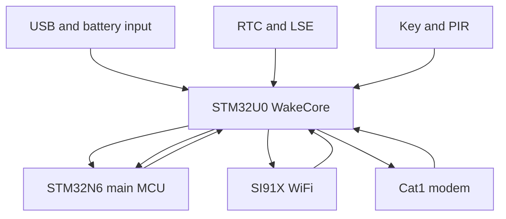
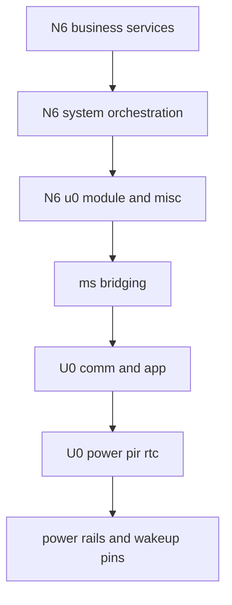
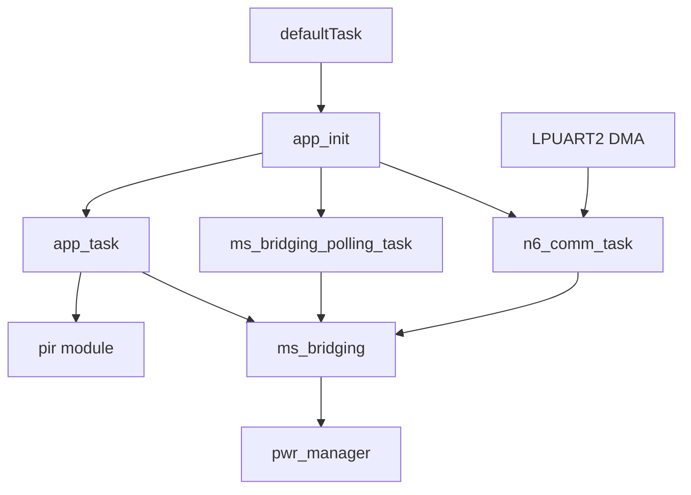
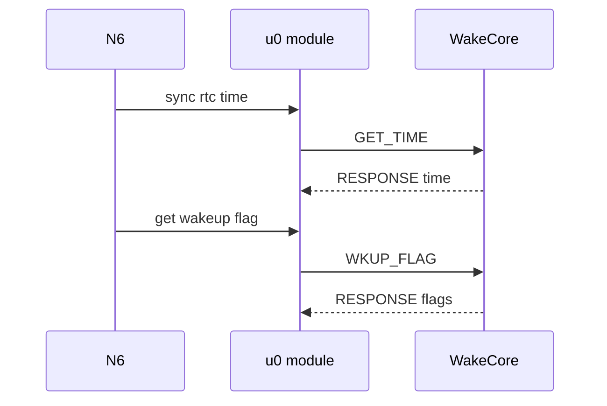
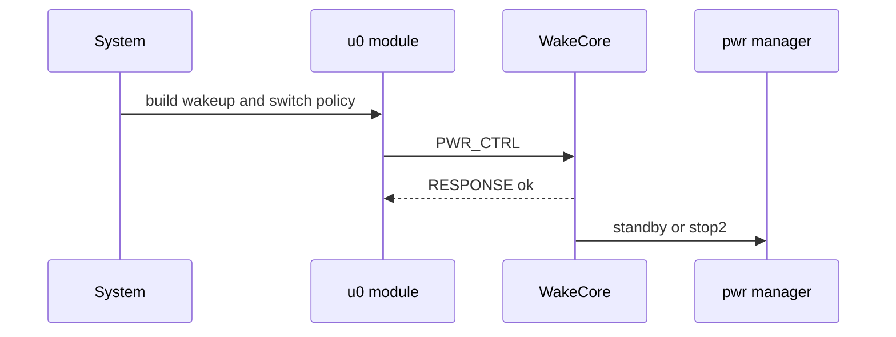
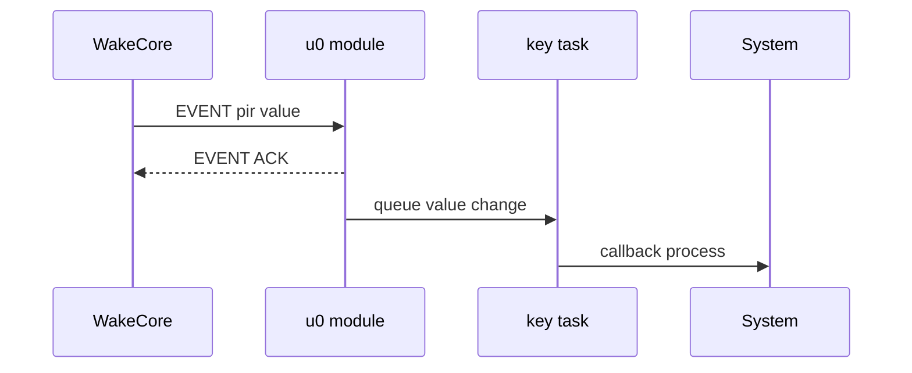
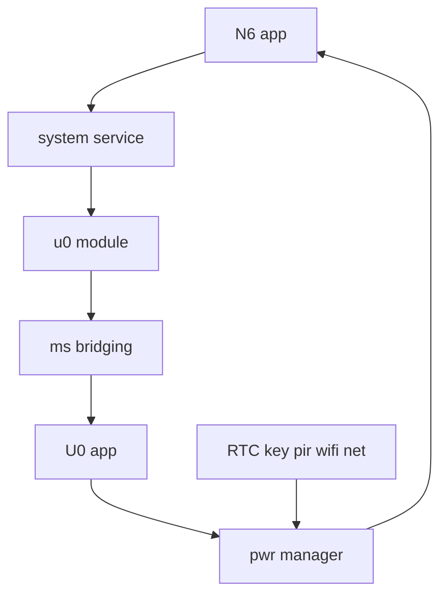
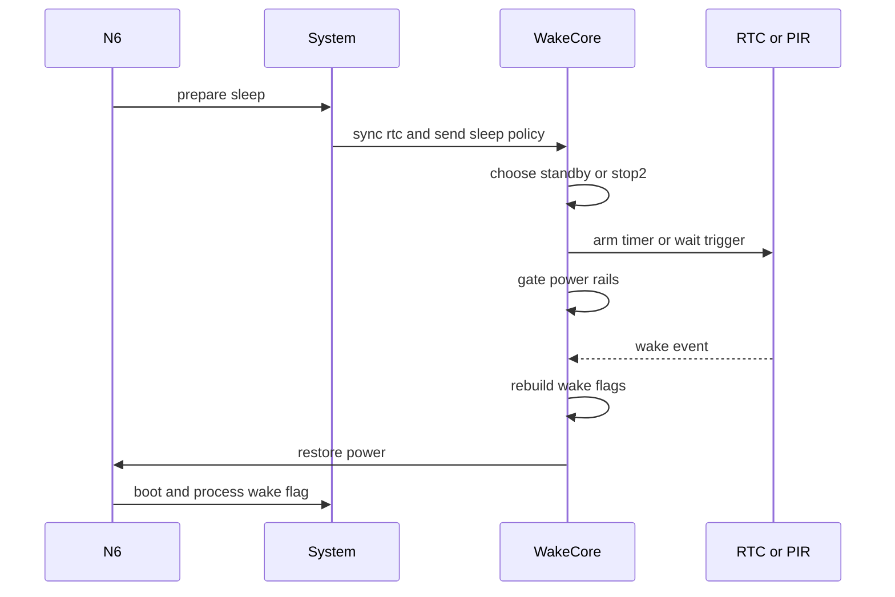
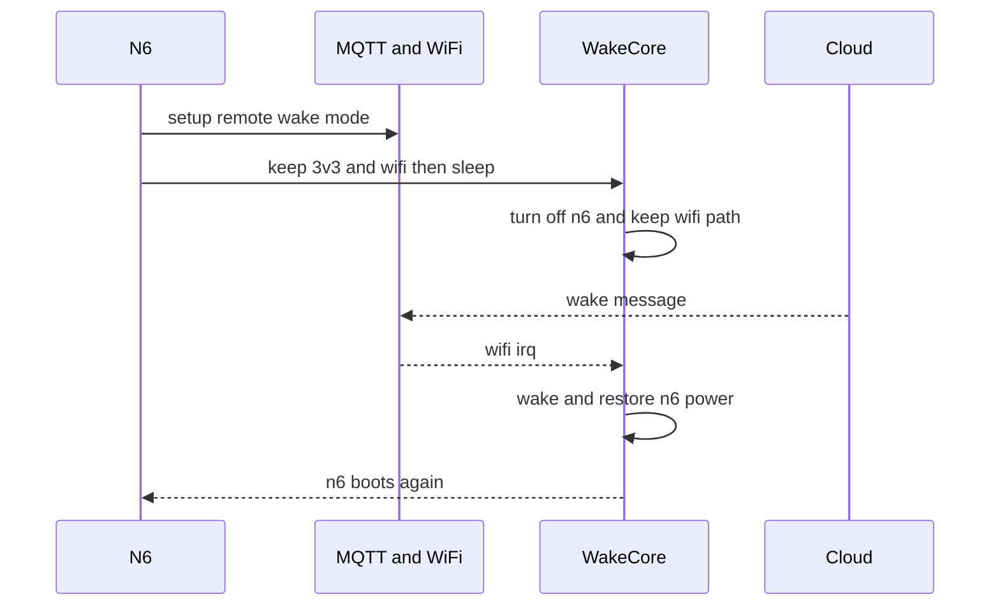

# NE301 低功耗设计完整分析

## 1. 结论先行

NE301 的低功耗不是单 MCU 内部做一个 `STOP` 就结束，而是一个典型的“双 MCU + 多电源域 + 分层唤醒”的系统设计：

- `STM32U0` 作为 `WakeCore` 常驻低功耗控制域，负责 `RTC`、按键/PIR/网络唤醒检测、板级电源开关控制，以及真正执行 `Standby` 或 `Stop2`
- `STM32N6` 负责 AI、视频、网络业务，但它当前并不是整机低功耗的主控者；它更像是“向 U0 声明本次睡眠策略”，然后由 U0 落地执行
- 整机低功耗的关键不在 N6 的 RTOS idle，而在 `U0 对 N6 AON/N6 主电源/WiFi/3V3/外设电源的门控`
- 唤醒后 N6 主要走“重新启动 + 读取 U0 唤醒标志 + 按唤醒源选择精简启动路径”的模式

如果只用一句话概括：

- `NE301` 的低功耗核心是 `WakeCore U0` 驱动的板级电源域管理，`STM32N6` 只是业务主控，不是低功耗主控

## 2. 分析范围与证据来源

本分析基于三类证据：

1. 官方资料
- 官方产品页下载区: [NE301 产品页](https://www.camthink.ai/productinfo/1971131.html)
- 官方原理图: [NE301-Schematic-Open.pdf](https://resources.camthink.ai/wiki/doc/NE301-Schematic-Open.pdf)
- 官方硬件指南: [NE301-Hardware%20Guide-Open.pdf](https://resources.camthink.ai/wiki/doc/NE301-Hardware%20Guide-Open.pdf)

2. 当前仓库源码
- `README.md`
- `Appli/Core/Src/main.c`
- `Custom/Services/System/system_service.c`
- `Custom/Services/service_init.c`
- `Custom/Services/Communication/communication_service.c`
- `Custom/Services/MQTT/mqtt_service.c`
- `Custom/Hal/u0_module.c`
- `WakeCore/Custom/User/app.c`
- `WakeCore/Custom/Components/pwr_manager/pwr_manager.c`
- `WakeCore/Custom/Components/pwr_manager/pwr_manager.h`
- `WakeCore/Core/Src/gpio.c`
- `WakeCore/Core/Src/main.c`
- `WakeCore/Core/Src/app_freertos.c`

3. 仓库内已有文档
- `Custom/Hal/u0_module_README.md`
- `Custom/Hal/Network/remote_wakeup_guide.md`

说明：

- 文中凡是写“原理图可见”的内容，来自官方原理图
- 文中凡是写“源码可见”的内容，来自当前仓库
- 文中凡是写“推断”的内容，表示这是根据原理图和源码交叉得到的工程推论，而不是单一文档明说

## 3. 低功耗总体架构

### 3.1 总览图



这张图背后的实际含义是：

- `U0` 是低功耗常开控制器
- `N6` 是高算力业务控制器
- `WiFi`、`Cat1`、`PIR`、`按键` 等唤醒事件先到 `U0`
- `U0` 再决定是否恢复 `N6` 供电并让整机重新启动

### 3.2 原理图信号和软件宏的对应关系

下表是理解 NE301 低功耗最关键的一张映射表。

| 原理图/硬件角色 | U0 侧 GPIO 宏 | 软件位定义 | 作用 |
| --- | --- | --- | --- |
| `PWR_3V3_EN` | `PWR_3V3_Pin` | `PWR_3V3_SWITCH_BIT` | 控制 3V3 电源域 |
| `WIFI_VDD1P8_EN` | `PWR_WIFI_Pin` | `PWR_WIFI_SWITCH_BIT` | 控制 WiFi 相关电源域 |
| `EN_POWER_AON` | `PWR_AON_Pin` | `PWR_AON_SWITCH_BIT` | 控制 N6 AON 电源域 |
| `EN_POWER_N6` | `PWR_N6_Pin` | `PWR_N6_SWITCH_BIT` | 控制 N6 主电源域 |
| `PWR_5V_EN` | `PWR_EXT_Pin` | `PWR_EXT_SWITCH_BIT` | 控制外部 5V 电源域 |
| `KEY_S1` | `CONFIG_KEY_Pin` | `PWR_WAKEUP_FLAG_CONFIG_KEY` | 配置键唤醒 |
| `SEN_INT` | `PIR_TRIGGER_Pin` | `PWR_WAKEUP_FLAG_PIR_*` | PIR 唤醒 |
| `WIFI_WAKEUP_GPIO` | `WIFI_SPI_IRQ_Pin` | `PWR_WAKEUP_FLAG_SI91X` | WiFi 远程唤醒 |
| `CAT1_WAKEUP_INT` | `NET_WKUP_Pin` | `PWR_WAKEUP_FLAG_NET` | Cat1 或网络唤醒 |

这说明官方硬件设计从一开始就是：

- `U0` 直接控制多个电源域
- `U0` 直接接收多个唤醒源
- 软件里的 `switch_bits` 和 `wakeup_flags` 不是抽象概念，而是和板级信号一一对应

## 4. 硬件低功耗设计分析

### 4.1 双 MCU 分工是整个方案的根

官方 README 已经明确写了：

- `STM32N6` 是主业务 MCU，负责视频、AI、网络
- `STM32U0` 是 `WakeCore`，负责低功耗和唤醒

这个分工非常关键，因为 `N6` 这类高性能主控并不适合长期常开做超低功耗待机；而 `U0` 天然更适合长期保留 `RTC`、检测唤醒源、再按需拉起 `N6`。

换句话说：

- `U0` 才是 Always On 控制面
- `N6` 是按需上电的高性能数据面

### 4.2 电源域切分是“省电”的基础

从官方原理图和 `WakeCore/Core/Inc/main.h`、`WakeCore/Custom/Components/pwr_manager/pwr_manager.h` 可以看出，NE301 至少明确切出了 5 类可控电源域：

- `3V3`
- `WiFi`
- `N6 AON`
- `N6`
- `EXT 5V`

这比“整板统一上电”高级很多，因为它允许设备在不同场景下保留不同能力：

| 场景 | 建议保留电源域 | 目标 |
| --- | --- | --- |
| 最深休眠 | 全关 | 极限省电 |
| 定时唤醒 | 全关 | 靠 U0 RTC 唤醒 |
| PIR 唤醒 | 取决于前端设计，当前代码意图支持低功耗 PIR 唤醒 | 保留传感器触发能力 |
| WiFi 远程唤醒 | `3V3 + WiFi` | 保留联网监听能力，但关闭 N6 |
| 调试供电 | 通常不走最深路径 | 兼顾调试稳定性 |

### 4.3 唤醒源不是“一个按键”，而是一个矩阵

`WakeCore` 代码里定义的唤醒标志包含：

- `RTC timing`
- `RTC alarm A`
- `RTC alarm B`
- `config key`
- `PIR high`
- `PIR low`
- `PIR rising`
- `PIR falling`
- `SI91X`
- `NET`
- `WUFI`
- `IWDG`
- `KEY_LONG_PRESS`
- `KEY_MAX_PRESS`

这说明 NE301 的低功耗设计目标不是“休眠后偶尔定时醒一次”，而是：

- 支持定时抓拍
- 支持 PIR 事件触发
- 支持按键分级动作
- 支持 WiFi 远程唤醒
- 预留蜂窝网络唤醒

### 4.4 U0 自带 RTC 和 LSE，是低功耗定时的根基

`WakeCore/Core/Src/main.c` 的时钟初始化里：

- 使能了 `LSE`
- 使能了 `RTC`
- 打开了 `Backup` 域访问

这意味着：

- U0 即使让 N6 下电，也能继续计时
- 定时唤醒、闹钟唤醒、唤醒原因跨复位保存都有基础

再结合 `pwr_manager.c` 里用 `RTC_BKP_DR1` 保存唤醒标志，可以确认：

- `Standby` 场景下 U0 自己会复位重启
- 但唤醒原因仍可通过 RTC 备份寄存器恢复

### 4.5 U0 不是只会“叫醒 N6”，它还能真正切电

`WakeCore/Custom/Components/pwr_manager/pwr_manager.c` 里直接对这些引脚做 `HAL_GPIO_WritePin`：

- `PWR_3V3_Pin`
- `PWR_EXT_Pin`
- `PWR_WIFI_Pin`
- `PWR_AON_Pin`
- `PWR_N6_Pin`

这说明：

- U0 不只是一个 GPIO 中断控制器
- 它是整板的电源域裁决者

这也是 NE301 低功耗能做深的根本原因：`U0` 能物理切掉 `N6` 和外围域。

### 4.6 USB 调试供电会改变低功耗行为

`WakeCore/Custom/User/app.c` 中，收到 `PWR_CTRL` 请求后并不是无条件进入 `Standby`：

- 如果请求的是 `STANDBY` 且 `usb_in_status == 0`，才真的走 `pwr_enter_standby()`
- 如果请求的是 `STANDBY` 但 `usb_in_status == 1`，会改走 `pwr_enter_stop2()`

这代表一个很实用的工程决策：

- 接着 USB 调试时，不强行走最深待机
- 避免调试电源场景、串口、下载链路和最深休眠互相打架

因此你在实验室里看到的功耗行为，未必和电池部署场景完全一样。

## 5. 软件实现分析

### 5.0 双 MCU 软件分层框架与设计思路

如果把 `NE301` 的低功耗实现只看成“`N6` 调 `u0_module_enter_sleep_mode_ex()`，`U0` 去执行 `Stop2` 或 `Standby`”，就会低估这套软件结构。

从源码实际组织方式看，它更接近一套“`N6` 做业务与策略，`U0` 做常驻控制与执行，串口协议把两边拼成一个系统”的分层架构。

#### 5.0.1 分层总览图



这张图里最关键的分界线是：

- `N6` 上面几层负责“业务目标”和“睡眠策略”
- `U0` 下面几层负责“常驻监控”和“真正执行电源动作”
- `ms_bridging` 是两边的软件边界

#### 5.0.2 各层职责与关键 API

| 层次 | 主要模块 | 关键 API | 主要职责 |
| --- | --- | --- | --- |
| 业务服务层 | `system_service`、`communication_service`、`mqtt_service`、`web_service` | `system_service_process_wakeup_event()`、`system_service_capture_request()` | 决定醒来后做什么，决定任务完成后是否重新入睡 |
| 系统编排层 | `main()`、`driver_core_init()`、`service_init()` | `u0_module_register()`、`service_init()` | 先注册驱动能力，再初始化系统服务，把 U0 通道尽早接入系统 |
| N6 适配层 | `u0_module.c`、`misc.c` | `u0_module_sync_rtc_time()`、`u0_module_get_wakeup_flag()`、`u0_module_cfg_pir()`、`u0_module_enter_sleep_mode_ex()`、`u0_module_callback_process()` | 把 U0 暴露成 N6 本地可调用的 HAL/Facade，而不是让业务层直接说协议 |
| 跨 MCU 协议层 | `ms_bridging.c`、`ms_bridging.h` | `ms_bridging_request_*()`、`ms_bridging_send_event()`、`ms_bridging_event_ack()`、`ms_bridging_polling()`、`ms_bridging_recv()` | 负责帧封装、CRC、ACK、重试、命令分发 |
| U0 控制层 | `app_task`、`ms_bridging_notify_callback()`、`n6_comm_task` | `ms_bridging_request_keep_alive()`、`ms_bridging_event_key_value()`、`ms_bridging_event_pir_value()` | 维护 N6 存活状态，处理 N6 的控制请求，上报按键和 PIR 变化 |
| U0 执行层 | `pwr_manager`、`pir`、`rtc`、`gpio` | `pwr_enter_standby()`、`pwr_enter_stop2()`、`pwr_ctrl_bits()`、`pwr_get_wakeup_flags()`、`pir_config()` | 直接操作 RTC、EXTI、GPIO、电源域和低功耗模式 |

可以把这张表再压缩成一句话：

- `system_service` 决策
- `u0_module` 适配
- `ms_bridging` 通信
- `WakeCore` 执行

#### 5.0.3 结合 U0 业务看这套设计思路

1. 控制面和业务面分离
- `N6` 负责 AI、视频、网络和系统策略
- `U0` 负责 Always On 控制、电源域门控、唤醒源采集和低功耗落地

2. 策略和执行分离
- `N6` 只声明这次要保留哪些电源、允许哪些唤醒源、要不要 RTC Alarm
- `U0` 决定具体怎么进 `Standby` 或 `Stop2`

3. 用 Facade 屏蔽跨 MCU 细节
- `system_service` 并不直接拼协议帧
- 它只调用 `u0_module_sync_rtc_time()`、`u0_module_get_wakeup_flag()`、`u0_module_enter_sleep_mode_ex()` 这类本地函数

4. 用异步事件把 U0 采样结果注入 N6 本地框架
- `U0` 上报 `KEY_VALUE` 和 `PIR_VALUE`
- `N6` 的 `u0_module` 先缓存，再丢到 `value_change_event_queue`
- `misc` 的 `keyTask` 周期性调用 `u0_module_callback_process()` 把变化转成本地回调

5. 用状态机而不是分散逻辑管理 U0 对 N6 的监督
- `U0 app_task` 用 `STARTUP`、`RUNNING`、`STOPPED`、`WAIT_REBOOT`
- 让睡眠、唤醒、失联恢复都落在同一套控制框架里

6. 用延后处理保证 N6 醒来后语义正确
- `system_service_init()` 启动时先把 `wakeup_flag` 读出来缓存
- 等所有服务起来后，再由 `system_service_process_wakeup_event()` 统一处理
- 这样不会在网络、存储、Web 等服务没准备好时就过早执行业务动作

#### 5.0.4 这套分层为什么适合低功耗产品

低功耗产品最怕两个问题：

- 业务模块都能直接碰睡眠和电源控制，最后谁都能把系统带乱
- 唤醒路径和运行态路径混在一起，导致醒来流程不可预测

NE301 当前实现用分层把这两个问题压住了：

- N6 业务层不直接碰底层电源
- U0 不承载复杂业务
- 双 MCU 之间只通过一个相对稳定的桥接协议交互

这不是为了“架构好看”，而是为了让低功耗策略能长期稳定演进。

### 5.1 U0 WakeCore 是真正执行低功耗的人

#### 5.1.1 U0 启动框架

`WakeCore` 的主路径是：

- `main()` 初始化时钟、GPIO、RTC、IWDG、串口
- `MX_FREERTOS_Init()` 创建 `defaultTask`
- `StartDefaultTask()` 调用 `app_init()`

`app_init()` 又做了几件低功耗相关的事：

- 读取上次唤醒标志 `pwr_get_wakeup_flags()`
- 如果是按键唤醒，等待按键释放 `pwr_wait_for_key_release()`
- 恢复默认上电域 `PWR_DEFAULT_SWITCH_BITS`
- 初始化 N6 通信链路
- 启动 `ms_bridging` 轮询任务

这说明 U0 的角色是：

- 先恢复自己对整机状态的认知
- 再决定如何和 N6 重新建立控制关系

#### 5.1.2 N6 和 U0 之间不是裸串口，而是一个协议层

N6 侧是 `UART9 + ms_bridging`

- `u0_module_register()`
- `ms_bridging_init()`
- `ms_bridging_polling_task`

U0 侧是 `LPUART2 + n6_comm + ms_bridging`

- `n6_comm_init()`
- `ms_bridging_notify_callback()`

所以低功耗控制不是零散命令，而是一套稳定的跨 MCU 协议。核心命令至少包括：

| N6 请求 | U0 动作 |
| --- | --- |
| `GET_TIME` | 读取 U0 RTC |
| `SET_TIME` | 更新 U0 RTC |
| `PWR_CTRL` | 执行上电、断电、睡眠 |
| `PWR_STATUS` | 返回当前电源域状态 |
| `WKUP_FLAG` | 返回唤醒标志 |
| `CLEAR_FLAG` | 清除唤醒标志 |
| `PIR_CFG` | 配置 PIR |
| `RST_N6` | 复位 N6 |

#### 5.1.3 U0 如何决定进 Standby 还是 Stop2

N6 侧 `u0_module_enter_sleep_mode()` 和 `u0_module_enter_sleep_mode_ex()` 的判定很明确：

- `switch_bits == 0`
- `sleep_second <= 0xFFFF`
- 不包含 `PIR rising` 或 `PIR falling`

满足这些条件时，才请求 `MS_BR_PWR_MODE_STANDBY`。

否则请求 `MS_BR_PWR_MODE_STOP2`。

这背后的工程逻辑是：

- `Standby` 用于最深休眠，通常意味着不保留电源域
- `Stop2` 用于要保留部分供电、要支持更多 EXTI 唤醒源、或 RTC 时间过长分段处理的场景

#### 5.1.4 U0 的 Standby 路径

`pwr_enter_standby()` 的关键动作有：

- 配置 `CONFIG_KEY` 为 WakeUp Pin
- 配置 `PIR` 的高低电平唤醒
- 配置 RTC 定时器和 Alarm A/B
- 把 `wakeup_flags` 写入 `RTC_BKP_DR1`
- 调用 `HAL_PWR_EnterSTANDBYMode()`

这个路径的特点是：

- 功耗最低
- U0 自己也会进入最深状态
- 唤醒后从复位重新启动
- 依赖 `RTC backup register` 恢复唤醒原因

#### 5.1.5 U0 的 Stop2 路径

`pwr_enter_stop2()` 的关键动作更复杂：

1. 先把大量 GPIO 配成 `analog`
2. 按 `switch_bits` 决定是否切掉 `3V3 EXT WIFI AON N6`
3. 配置 `CONFIG_KEY`、`PIR`、`NET_WKUP`、`WIFI_SPI_IRQ` 的 EXTI
4. 配置 RTC 定时器和 Alarm
5. 反初始化 UART
6. 调用 `HAL_PWREx_EnterSTOP2Mode()`
7. 醒来后重配系统时钟、串口、GPIO 和被关闭的电源域

它的优点是：

- 可以保留部分板级供电
- 可以支持更多唤醒输入
- 唤醒后从 `HAL_PWREx_EnterSTOP2Mode()` 之后继续执行，不必整机重新从 reset vector 开始

但对 NE301 整机来说，是否“整机不重启”还取决于有没有把 `N6` 电源域也保留下来。

#### 5.1.6 U0 如何重建唤醒原因

`pwr_get_wakeup_flags()` 会综合这些来源：

- `PWR_FLAG_SB`
- `PWR_FLAG_STOP2`
- `PWR_FLAG_WUF1`
- `PWR_FLAG_WUF3`
- `PWR_FLAG_WUF4`
- `PWR_FLAG_WUFI`
- RTC 唤醒和 Alarm 标志
- `stop2_wakeup_rising_pins`
- `stop2_wakeup_falling_pins`

所以 U0 返回给 N6 的唤醒原因，不是单一寄存器原样转发，而是一次“唤醒原因重建”。

这也是为什么 N6 业务层能够直接看到：

- RTC
- 按键短按
- 按键长按
- 超长按
- PIR 上升沿
- PIR 下降沿
- WiFi
- Net

#### 5.1.7 U0 还做了几处很有价值的低功耗细节

1. `Flash_OPT_Check()` 会把 U0 的 `IWDG_STOP` 和 `IWDG_STDBY` 关闭
- 否则深睡时看门狗会制造很多干扰

2. `PWR_RTC_WAKEUP_MAX_TIME_S = 0xFFFF`
- 超过 RTC 单次能力的长睡眠，会在 `Stop2` 里分段睡

3. `PWR_RTC_WAKEUP_ADV_OFFSET_S = 1`
- 预留 1 秒提前量，避免边界误差

4. 请求睡眠时间如果小于等于 1 秒
- U0 不值得真的睡下去，会直接 `pwr_n6_restart()`

5. 按键释放等待逻辑支持：
- 短按
- 长按 `2000 ms`
- 超长按 `10000 ms`

这意味着按键在低功耗架构里不是简单的“唤醒”，而是一个有语义层级的输入源。

#### 5.1.8 U0 软件架构与任务模型

前面的分析更多是在讲 `U0` 做了哪些低功耗动作。换一个软件架构视角去看，`WakeCore` 实际上不是一组零散函数，而是一个非常小、但职责很清晰的“低功耗监督运行时”：

- 底层 RTOS 是 `FreeRTOS`
- 启动壳使用了 `CMSIS-RTOS2` 接口
- 真正常驻运行的是 3 个应用 task
- `pwr_manager`、`pir`、`ms_bridging` 这些更像组件，不是独立 task

##### 5.1.8.1 U0 启动与任务总览

`WakeCore/Core/Src/main.c` 的主路径是：

- `HAL_Init()`
- `SystemClock_Config()`
- `MX_GPIO_Init()`、`MX_DMA_Init()`、`MX_LPUART2_UART_Init()`、`MX_RTC_Init()`、`MX_IWDG_Init()`
- `osKernelInitialize()`
- `MX_FREERTOS_Init()`
- `osKernelStart()`

这里的任务模型分析，是基于当前工程实际编译配置 `APP_IS_USER_STR_CMD == 0`，也就是正式的 `ms_bridging` 协议路径，而不是调试用的串口命令分支。

其中 `MX_FREERTOS_Init()` 只先创建了一个 `defaultTask`，而 `defaultTask` 的工作也很简单：

- 调用 `app_init()`
- 完成后 `vTaskDelete(NULL)` 自删除

也就是说，`defaultTask` 只是启动壳，不是长期业务线程。真正常驻的任务，是 `app_init()` 里继续拉起来的那几个 task。

##### 5.1.8.2 U0 任务关系总览图



这张图表达的核心意思是：

- `n6_comm_task` 负责字节流收发
- `ms_bridging_polling_task` 负责把协议帧分发成命令
- `app_task` 负责 N6 存活监督、按键和 PIR 事件上报、停机和重启协同
- `pwr_manager` 只是被调用的低功耗执行器，不是独立线程

##### 5.1.8.3 U0 主要 task 一览

| Task | 创建位置 | 优先级和栈 | 核心职责 | 与低功耗的关系 |
| --- | --- | --- | --- | --- |
| `defaultTask` | `WakeCore/Core/Src/app_freertos.c` | `osPriorityNormal`，`256 * 4` | 仅做一次 `app_init()` 启动引导 | 负责把 U0 从裸机初始化切换到业务运行态 |
| `n6_comm_task` | `WakeCore/Custom/Components/n6_comm/n6_comm.c` | `5`，`1024` | 驱动 `LPUART2 DMA`，等待收发和错误事件，收包后回调上层 | 是 U0 和 N6 低功耗协议的传输层 |
| `ms_bridging_polling_task` | `WakeCore/Custom/User/app.c` | `3`，`1536` | 轮询 `ms_bridging` 的通知帧缓存，并调用协议回调 | 是低功耗命令真正被解释和执行的入口 |
| `app_task` | `WakeCore/Custom/User/app.c` | `2`，`1536` | 维护 N6 状态机，轮询按键和 PIR，处理停机和重启协同 | 是 U0 对 N6 的监督控制面 |
| `Idle task` | `FreeRTOS` 内核 | 内核自动创建 | 空闲时运行 `vApplicationIdleHook()` | 当前实现里会在 idle hook 中刷新 `IWDG` |
| `Timer task` | `FreeRTOS` 内核 | 内核自动创建 | 处理 RTOS 定时器机制 | 当前业务未把它当作主控制面使用 |

这里还能看出一个很典型的优先级设计意图：

- `n6_comm_task` 优先级最高，保证串口链路尽量不丢包
- `ms_bridging_polling_task` 次之，尽快把协议命令分发出去
- `app_task` 更像后台监督线程，优先级最低

##### 5.1.8.4 每个 task 是如何工作的

`defaultTask`

- 只运行一次
- 完成 `app_init()` 后立即删除自己
- 它的意义是把 Cube 生成的 RTOS 启动流程和用户应用解耦

`n6_comm_task`

- 启动后先调用 `HAL_UARTEx_ReceiveToIdle_DMA()`
- 然后长期阻塞在 `xEventGroupWaitBits()`
- 等待的事件主要是 `N6_COMM_EVENT_RX_DONE`、`N6_COMM_EVENT_TX_DONE`、`N6_COMM_EVENT_ERR`
- 收到一帧数据后，计算本次接收长度，再调用 `n6_comm_recv_callback()`
- 发送路径则通过 `n6_comm_send()` 持有互斥锁，发 DMA，再等待 `TX_DONE`

它本质上是一个“串口 DMA 传输 task”，不关心业务语义，只负责把 N6 和 U0 之间的字节流可靠地送上去。

`ms_bridging_polling_task`

- 死循环调用 `ms_bridging_polling(g_ms_bridging_handler)`
- `ms_bridging` 内部维护 `notify_frame` 和 `ack_frame` 缓冲
- 新到的请求帧和事件帧会先进 `notify_frame`
- 这个 task 再把它们逐个交给 `ms_bridging_notify_callback()`

它本质上是“协议分发 task”。这样做的好处是：

- 串口接收上下文只负责收包
- 复杂命令不在 DMA 或 ISR 邻近路径里直接执行
- 低功耗控制逻辑可以放在更安全的线程上下文中完成

`app_task`

- 它不是简单轮询线程，而是一个围绕 `N6_STATE_*` 的状态机
- 它维护的状态至少包括 `STARTUP`、`RUNNING`、`STOPPED`、`WAIT_REBOOT`
- `STARTUP` 阶段主要做 `keep alive` 握手，并把当前按键状态同步给 N6
- `RUNNING` 阶段持续检测按键和 PIR 引脚变化，并通过 `ms_bridging_event_key_value()`、`ms_bridging_event_pir_value()` 通知 N6
- `STOPPED` 阶段等待外部重新发出 `START` 事件
- `WAIT_REBOOT` 阶段会触发 `pwr_n6_restart()`，并把链路重新拉回 `STARTUP`

所以 `app_task` 的角色不是做具体低功耗寄存器配置，而是作为：

- `N6` 在线状态监督器
- 本地唤醒源事件采集器
- 睡眠前后控制面的协同者

##### 5.1.8.5 U0 task 之间如何通信

U0 的 task 数量不多，但通信分层很明确：

| 通信对象 | 机制 | 代码位置 | 作用 |
| --- | --- | --- | --- |
| `n6_comm_task` 内部收发同步 | `EventGroup` | `n6_comm.c` | 同步 `RX_DONE`、`TX_DONE`、`ERR` 三类串口事件 |
| `n6_comm_send()` 并发保护 | `Mutex` | `n6_comm.c` | 确保多处发包不会同时抢占 `LPUART2` |
| `ms_bridging` 请求应答 | `ack_sem + ack_frame` | `ms_bridging.c` | 等待 N6 返回 response 或 event ack |
| `ms_bridging` 通知分发 | `notify_sem + notify_frame` | `ms_bridging.c` | 把请求帧缓存后交给 `ms_bridging_polling_task` 处理 |
| `ms_bridging_notify_callback` 与 `app_task` | `osEventFlags` | `app.c` | 做 `STOP`、`STOP_ACK`、`START`、`START_ACK` 协同 |
| `app_task` 与 N6 | `ms_bridging_event_*` | `app.c` | 上报按键和 PIR 状态变化 |

从这个结构可以看出，U0 侧通信其实分成了 3 层：

1. `n6_comm_task`
- 负责“字节什么时候收到了”

2. `ms_bridging`
- 负责“这是一条什么协议命令”

3. `app_task` 和 `pwr_manager`
- 负责“收到命令后该怎么改系统状态和电源状态”

##### 5.1.8.6 app_task 状态机分析

`app_task` 是 U0 软件设计里最关键的一层。它把“低功耗控制”抽象成了一个小状态机，而不是很多分散的 if else。

| 状态 | 主要动作 | 转移条件 |
| --- | --- | --- |
| `N6_STATE_STARTUP` | 向 N6 发 `keep alive`，同步初始按键值 | 成功后进 `RUNNING`；持续失败则进 `WAIT_REBOOT` |
| `N6_STATE_RUNNING` | 监控按键和 PIR 变化，必要时做 keep alive | 通信失败进 `WAIT_REBOOT`；收到 `STOP` 事件进 `STOPPED` |
| `N6_STATE_STOPPED` | 阻塞等待 `START` 事件 | 收到 `START` 后回到 `STARTUP` |
| `N6_STATE_WAIT_REBOOT` | 重启 N6，强制通信层重新进入错误恢复 | 完成后回到 `STARTUP` |

这种设计的工程价值很大：

- N6 不在线时，U0 能主动发现而不是一直假设链路正常
- 进入睡眠前，U0 会先让监督 task 明确停住
- 醒来后，U0 不是直接假设系统恢复完毕，而是重新走一次握手

##### 5.1.8.7 低功耗进入和恢复时，task 如何协同

以 `PWR_CTRL` 请求进入 `Stop2` 为例，U0 内部大致会按下面的链路运行：

1. `n6_comm_task` 收到 N6 发来的协议帧
2. `n6_comm_recv_callback()` 把数据喂给 `ms_bridging_recv()`
3. `ms_bridging_polling_task` 调用 `ms_bridging_notify_callback()`
4. `ms_bridging_notify_callback()` 先回复 ACK，随后发 `APP_TASK_EVENT_FLAG_STOP`
5. `app_task` 收到 `STOP`，切到 `N6_STATE_STOPPED`，再回 `STOP_ACK`
6. U0 调用 `vTaskSuspendAll()`，进入 `pwr_enter_stop2()`
7. 醒来后 `xTaskResumeAll()`，并注入一次 `N6_COMM_EVENT_ERR` 让通信层重建
8. 再发 `APP_TASK_EVENT_FLAG_START`
9. `app_task` 收到后回到 `N6_STATE_STARTUP`
10. U0 重新和 N6 做 keep alive 握手

这条链路说明一个很重要的实现特点：

- 低功耗切换不是“某个函数突然直接睡下去”
- 而是“通信层确认完成 -> 监督 task 停住 -> 电源管理执行 -> 唤醒后监督 task 再恢复”

##### 5.1.8.8 U0 软件设计的几个关键特点

综合看，U0 软件设计体现出 4 个很清晰的工程取向：

1. 控制面和数据面分离
- `n6_comm_task` 只管传输
- `ms_bridging_polling_task` 只管协议分发
- `app_task` 只管状态监督和事件采集

2. 低功耗动作中心化
- 真正进入 `Standby` 或 `Stop2` 的入口集中在 `ms_bridging_notify_callback()` 和 `pwr_manager`
- 没有让多个 task 随意直接改系统电源状态

3. 用状态机而不是分散逻辑做 N6 监督
- `STARTUP`、`RUNNING`、`STOPPED`、`WAIT_REBOOT` 让睡眠、唤醒、失联恢复都能落在同一套框架里

4. 用轻量同步原语替代复杂对象
- `EventGroup`
- `Semaphore`
- `EventFlags`
- 很少引入重量级消息队列或多级调度

这很符合 `U0 WakeCore` 的定位：它不是一个要跑复杂业务的 MCU，而是一个追求可预测、低功耗、低复杂度的常驻控制核。

### 5.2 N6 侧软件只是“声明策略”，不是执行者

#### 5.2.1 N6 启动后先同步时间和读取唤醒标志

`system_service_init()` 启动时会：

- `u0_module_sync_rtc_time()`
- `u0_module_get_wakeup_flag()`
- 把结果存到 `last_wakeup_flag`

然后在 `main()` 完成：

- `framework_init()`
- `driver_core_init()`
- `core_system_init()`
- `service_init()`

之后再执行：

- `system_service_process_wakeup_event()`

这是一种很稳妥的处理方式：

- 先把系统服务都拉起来
- 再根据唤醒原因决定抓拍、联网、开 AP、工厂复位等行为

#### 5.2.2 N6 如何把唤醒原因转换成业务动作

`process_u0_wakeup_flag()` 的映射关系基本是：

| U0 唤醒标志 | N6 业务唤醒源 |
| --- | --- |
| `RTC_TIMING` 或 `RTC_ALARM_A/B` | `WAKEUP_SOURCE_RTC` |
| `KEY_MAX_PRESS` | 工厂复位类动作 |
| `KEY_LONG_PRESS` | 长按开 AP |
| `CONFIG_KEY` | 短按抓拍 |
| `PIR_*` | `WAKEUP_SOURCE_PIR` |
| `SI91X` 或 `NET` | `WAKEUP_SOURCE_REMOTE` |
| `WUFI` | `WAKEUP_SOURCE_WUFI` |

也就是说：

- U0 负责判断“硬件是怎么醒的”
- N6 负责判断“醒来后业务要干什么”

#### 5.2.3 N6 入睡前的准备动作

`prepare_for_sleep()` 至少做了 5 件事：

1. 先停 `web_service`
2. 把当前 RTC 时间更新到 U0
3. 如果启用 PIR，先把 PIR 参数下发给 U0
4. 保存关键配置到 NVS
5. 把系统状态设成 `SYSTEM_STATE_SLEEP`

这说明设计者考虑的不只是“怎么睡”，还考虑了：

- 睡前状态一致性
- 醒后 RTC 连续性
- PIR 唤醒参数一致性
- Web 栈在网络下电前的退出顺序

#### 5.2.4 N6 如何决定本次保留哪些唤醒源

`configure_u0_wakeup_sources()` 的逻辑可概括为：

#### 在 `LOW_POWER` 模式下

默认启用：

- `RTC timing`
- `config key`

按配置可再叠加：

- `PIR`
- `RTC alarm A`
- `SI91X remote wakeup`

如果启用了远程唤醒，还会在睡前做一整套联网动作：

- 等待 `STA ready`
- 把 MQTT backend 切到 `SI91X`
- 调 `sl_net_netif_romote_wakeup_mode_ctrl()`
- 启动 MQTT 并重试连接
- 调 `sl_net_netif_low_power_mode_ctrl(1)`
- 成功后再给 U0 增加 `PWR_WAKEUP_FLAG_SI91X`

如果失败：

- 不直接报废
- 自动加一个 `1800 s` 的 RTC fallback 唤醒，后面再重试

这是一种很成熟的“远程唤醒失败降级策略”。

#### 在 `FULL_SPEED` 模式下

虽然代码也能组装更宽松的唤醒源集合，但 `should_enter_sleep_after_task()` 明确规定：

- `LOW_POWER` 模式下任务完成后自动睡
- `FULL_SPEED` 模式下保持活跃，不自动睡

因此整机真正的自动低功耗闭环，主要围绕 `LOW_POWER` 模式展开。

#### 5.2.5 N6 如何决定本次保留哪些电源域

`configure_u0_power_switches()` 的设计很关键：

#### `LOW_POWER`

默认：

- `switch_bits = 0`

只有远程唤醒成功配置时，才保留：

- `PWR_WIFI_SWITCH_BIT`
- `PWR_3V3_SWITCH_BIT`

这意味着典型低功耗远程唤醒场景是：

- `WiFi` 还活着
- `N6` 和 `AON` 不保留
- 来消息后由 U0 重新拉起 N6

#### `FULL_SPEED`

会保留：

- `3V3`
- `AON`
- `N6`

可选再加：

- `WiFi`

但如前所述，这条路径当前不是自动睡眠主路径。

#### 5.2.6 双 MCU 通信在软件框架中的位置

虽然从业务语义上看，`U0` 更像 `N6` 的低功耗协处理器，但从代码结构看，二者不是主从寄存器关系，而是一个明确的“串口 RPC + 异步事件”模型。

当前工程里，这条链路在软件框架中的位置是：

- `driver_core_init()` 很早就调用 `u0_module_register()`，先把 U0 通道建起来
- `system_service_init()` 启动时通过 `u0_module` 同步 RTC、读取唤醒标志
- `system_service` 在入睡前通过 `u0_module` 下发 PIR 配置、电源域保留策略、唤醒源集合和 RTC Alarm
- `U0` 运行中通过 `KEY_VALUE`、`PIR_VALUE` 事件把本地采样结果回推给 `N6`

也就是说，`N6` 和 `U0` 的通信不是某个功能点里的临时调用，而是：

- 启动时要用
- 运行时要用
- 入睡前要用
- 唤醒后还要用

#### 5.2.7 双 MCU 通信链路总览图


这张图反映出一个重要事实：

- `N6` 和 `U0` 之间没有共享内存
- 也没有板级 mailbox
- 当前完全依赖 `UART9 <-> LPUART2` 上的 `ms_bridging` 协议

#### 5.2.8 物理链路和线程模型

源码可见，双 MCU 通信的物理与线程模型如下：

| 项目 | N6 侧 | U0 侧 | 说明 |
| --- | --- | --- | --- |
| 物理串口 | `UART9` | `LPUART2` | 两边通过专用串口互联 |
| 串口参数 | `115200 8N1` | `115200 8N1` | 无硬件流控 |
| 接收方式 | `HAL_UARTEx_ReceiveToIdle_IT()` | `HAL_UARTEx_ReceiveToIdle_DMA()` | N6 用中断空闲接收，U0 用 DMA 空闲接收 |
| 发送方式 | `HAL_UART_Transmit_IT()` | `HAL_UART_Transmit_DMA()` | N6 发送后轮询 `gState`，U0 用事件组等 `TX_DONE` |
| N6 协议轮询线程 | `ms_bd_Task` | 无 | 在 `u0_module_register()` 中创建 |
| U0 协议传输线程 | 无 | `n6_comm_task` | 负责 UART 收发和错误恢复 |
| U0 协议分发线程 | 无 | `ms_bridging_polling_task` | 负责把协议帧变成命令处理 |
| U0 监督线程 | 无 | `app_task` | 负责 keep alive 和 key PIR 上报 |

这里体现了两端的职责非对称：

- `N6` 是业务主控，所以只需要一个 `u0_module + ms_bd_Task` 适配层
- `U0` 是常驻控制核，所以需要传输、协议、监督三层常驻 task

#### 5.2.9 当前通信模式不是一种，而是两种

`ms_bridging` 当前实际上支持两种通信模式：

| 模式 | 帧类型 | 当前主要方向 | 代表命令 | 用途 |
| --- | --- | --- | --- | --- |
| 同步请求应答 | `REQUEST` 和 `RESPONSE` | 主要是 `N6 -> U0`，少量 `U0 -> N6` | `GET_TIME`、`PWR_CTRL`、`WKUP_FLAG`、`PIR_CFG`、`KEEPLIVE` | 读状态、下策略、执行控制 |
| 异步事件确认 | `EVENT` 和 `EVENT_ACK` | 主要是 `U0 -> N6` | `KEY_VALUE`、`PIR_VALUE` | 把 U0 本地事件推送给 N6 |

可以把它理解成：

- `REQUEST/RESPONSE` 更像 RPC
- `EVENT/EVENT_ACK` 更像带确认的通知

#### 5.2.10 `ms_bridging` 协议帧格式详细分析

协议帧格式来自 `Custom/Common/Lib/ms_bridging/ms_bridging.h`：

```text
SOF 1B | ID 2B | LEN 2B | TYPE 2B | CMD 2B | HEADER CRC 2B | DATA N B | DATA CRC 2B if LEN > 0
```

其中头部结构是 `#pragma pack(1)` 的 `ms_bridging_frame_header_t`，所以头长度固定为 `11` 字节。

字段含义如下：

| 字段 | 长度 | 含义 |
| --- | --- | --- |
| `sof` | 1 字节 | 帧起始，固定 `0xBD` |
| `id` | 2 字节 | 帧序号，用于匹配 response 或 event ack |
| `len` | 2 字节 | 数据区长度 |
| `type` | 2 字节 | `REQUEST`、`RESPONSE`、`EVENT`、`EVENT_ACK` |
| `cmd` | 2 字节 | 命令字 |
| `crc` | 2 字节 | 头部 CRC |
| `data` | 变长 | 命令负载 |
| `data_crc` | 2 字节 | 数据区 CRC，仅在 `len > 0` 时存在 |

CRC 的实现也很直接：

- 算法是 `CRC16 CCITT`
- 多项式是 `0x1021`
- 初始值是 `0xFFFF`

推断：

- 由于两端都对 packed struct 直接 `memcpy` 后发串口
- 两端 MCU 都是 `STM32` little endian

所以这个协议在当前实现里实际上是“小端字节序的结构体直传协议”。这一点不是协议文档显式写出的，而是从源码实现推断出来的。

#### 5.2.11 协议可靠性机制

`ms_bridging` 之所以适合拿来做低功耗控制，不是因为它复杂，而是因为它在一个简单串口上补了几层必要的可靠性：

| 机制 | 当前实现 |
| --- | --- |
| 帧完整性 | 头 CRC 和数据 CRC 双重校验 |
| 请求匹配 | 用 `id + cmd + frame type` 匹配回包 |
| 应答等待 | `ack_sem` 和 `ack_frame` 缓冲 |
| 异步分发 | `notify_sem` 和 `notify_frame` 缓冲 |
| 等待超时 | `MS_BR_WAIT_ACK_TIMEOUT_MS = 500` |
| 轮询间隔 | `MS_BR_WAIT_ACK_DELAY_MS = 20` |
| 单次发送超时 | `MS_BR_FRAME_SEND_TIMEOUT_MS = 100` |
| 重试配置 | `MS_BR_RETRY_TIMES = 3` |
| 缓冲槽数 | `MS_BR_FRAME_BUF_NUM = 4` |
| 协议输入上限 | `MS_BR_BUF_MAX_SIZE = 512` |

还有一个细节值得单独说明：

- `ms_bridging_request()` 和 `ms_bridging_send_event()` 都是 `do while`
- 在当前写法下，`MS_BR_RETRY_TIMES = 3` 表示“最多 4 次发送机会”，也就是“首次发送 + 3 次重试”

这不是概念层面的推断，而是源码行为。

#### 5.2.12 当前实现支持的命令矩阵

从当前 `N6` 和 `U0` 两侧的通知回调看，协议虽然是对称设计，但产品实现是非对称使用。

##### N6 向 U0 发起的主要请求

| 命令 | 请求负载 | 响应负载 | U0 侧处理 | 典型用途 |
| --- | --- | --- | --- | --- |
| `GET_TIME` | 无 | `ms_bridging_time_t` | 读 U0 RTC | N6 启动时同步 RTC |
| `SET_TIME` | `ms_bridging_time_t` | 无 | 写 U0 RTC | N6 入睡前把当前 RTC 写给 U0 |
| `PWR_CTRL` | `ms_bridging_power_ctrl_t` | 无 | 执行电源控制或入睡 | 整机低功耗主入口 |
| `PWR_STATUS` | 无 | `uint32_t` | 返回 `switch_bits` | 读取当前保留电源域 |
| `WKUP_FLAG` | 无 | `uint32_t` | 返回 `wakeup_flags` | 读取上次唤醒原因 |
| `CLEAR_FLAG` | 无 | 无 | 清除唤醒标志 | 清状态 |
| `RST_N6` | 无 | 无 | 复位 N6 | 自恢复或测试 |
| `KEY_VALUE` | 无 | `uint32_t` | 读按键当前值 | 轮询键值 |
| `PIR_VALUE` | 无 | `uint32_t` | 读 PIR 当前值 | 轮询 PIR |
| `USB_VIN_VALUE` | 无 | `uint32_t` | 读 USB 供电状态 | 判断调试供电 |
| `PIR_CFG` | `ms_bridging_pir_cfg_t` | `uint32_t` | 配置 PIR 前端 | 睡前或启动时下发 PIR 参数 |
| `GET_VERSION` | 无 | `ms_bridging_version_t` | 返回 U0 固件版本 | 诊断和兼容性检查 |

##### U0 向 N6 发起的主要请求

| 命令 | 请求负载 | 响应负载 | N6 侧处理 | 典型用途 |
| --- | --- | --- | --- | --- |
| `KEEPLIVE` | 无 | 无 | 立即回复 | U0 监督 N6 是否在线 |
| `GET_VERSION` | 无 | `ms_bridging_version_t` | 返回 N6 固件版本 | 诊断用途 |

##### U0 向 N6 发起的异步事件

| 事件 | 事件负载 | N6 侧动作 | ACK |
| --- | --- | --- | --- |
| `KEY_VALUE` | `uint32_t` | 更新 `g_key_value`，投递 `value_change_event_queue` | `EVENT_ACK` |
| `PIR_VALUE` | `uint32_t` | 更新 `g_pir_value`，投递 `value_change_event_queue` | `EVENT_ACK` |

这里体现了两个重要设计点：

- `U0` 不只是“执行 N6 命令”，它也会主动推事件
- `N6` 收到事件后并不在串口回调里直接做业务，而是先缓存再异步处理

#### 5.2.13 关键 payload 结构体含义

当前低功耗链路里，最关键的 3 个 payload 是：

| 结构体 | 关键字段 | 含义 |
| --- | --- | --- |
| `ms_bridging_time_t` | `year month day week hour minute second` | U0 和 N6 之间同步 RTC 时间 |
| `ms_bridging_alarm_t` | `is_valid week_day date hour minute second` | 描述 Alarm A 或 Alarm B 的触发时刻 |
| `ms_bridging_power_ctrl_t` | `power_mode switch_bits wakeup_flags sleep_second alarm_a alarm_b` | 一次完整的低功耗策略描述 |

其中 `ms_bridging_power_ctrl_t` 是整个低功耗协议的核心。它把 4 类信息一次性打包给 U0：

1. 这次想走哪种睡眠模式
- `NORMAL`
- `STANDBY`
- `STOP2`

2. 睡的时候哪些电源域保留
- `switch_bits`

3. 允许哪些源把系统叫醒
- `wakeup_flags`

4. 什么时候叫醒
- `sleep_second`
- `alarm_a`
- `alarm_b`

这也解释了为什么 `u0_module_enter_sleep_mode_ex()` 会成为 `N6 -> U0` 的关键入口。

#### 5.2.14 三条最重要的通信时序

##### 启动后读取 RTC 和唤醒标志



##### N6 下发一次睡眠策略



##### U0 上报一次 PIR 变化



##### 运行时语义补充

- 启动阶段，通信是“同步读取状态”为主
- 入睡阶段，通信是“下发策略并由 U0 执行”为主
- 运行阶段，通信是“U0 异步上报局部状态变化”为主

#### 5.2.15 这套通信设计体现出的软件思路

1. 对 N6 来说，U0 被包装成本地设备而不是远端 MCU
- 业务层只见 `u0_module_*`
- 看不到底层串口和帧协议细节

2. 对 U0 来说，N6 不是绝对主控，而是受监督对象
- `app_task` 会主动发 `KEEPLIVE`
- N6 失联时 U0 能切到 `WAIT_REBOOT`

3. 控制命令和传感器事件分两种语义通道
- 控制走 `REQUEST/RESPONSE`
- 变化上报走 `EVENT/EVENT_ACK`

4. 关键状态会被缓存，避免高层频繁同步阻塞
- `g_key_value`
- `g_pir_value`
- `g_power_status`
- `g_wakeup_flag`

5. 运行态输入事件会复用 N6 现有框架
- `u0_module_callback_process()` 被放进 `keyTask`
- 说明设计者希望把“来自 U0 的按键和 PIR”伪装成本地输入源

#### 5.2.16 当前通信实现的边界与注意点

有几处实现特点，后面如果你继续扩展协议，需要特别注意：

1. 未识别命令通常不会自动回错误码
- 当前两侧 `notify callback` 对 unknown cmd 大多只是 `break`
- 结果通常是发起方等到超时，而不是收到显式错误响应

2. 协议是同构 MCU 优化协议，不是通用跨平台协议
- packed struct 直传很高效
- 但可移植性和字节序自描述能力较弱

3. 缓冲槽只有 4 个
- `notify_frame` 和 `ack_frame` 都是 4 槽
- 在极端突发情况下，可能出现无空槽而丢帧

4. N6 侧发送路径是中断发送加轮询等待
- 不是纯事件驱动
- 但因为当前控制流量很低，所以工程上仍可接受

5. 当前产品实现里，N6 不主动向 U0 发异步事件
- 现阶段主要是 U0 把 key 和 PIR 回推给 N6
- 协议能力比当前业务用法更宽

把这些点放在一起看，`NE301` 的双 MCU 通信并不是一个“大而全”的总线协议，而是一套围绕低功耗控制场景裁出来的轻量级专用协议。

### 5.3 N6 醒来后还做了启动路径优化

NE301 的低功耗价值不只在“睡得下去”，还在“醒来后尽快干完事再回去”。

#### 5.3.1 只启动必要服务

`service_init.c` 中，服务启动时会看：

- 当前 power mode
- 当前 wakeup source
- `required_in_low_power`

在 `LOW_POWER` 且当前唤醒源只需要核心能力时，会跳过非必要服务，例如：

- `web_service`
- `ota_service`
- `rtmp_service`
- `ai_service`

这能显著缩短活跃时长。

#### 5.3.2 通信层会走“快连模式”

`communication_service.c` 对 RTC/PIR/短按等时效性唤醒源做了优化：

- 优先使用最近连过的网络
- 可以不等扫描结果，直接按上次 BSSID 尝试连接
- 连接超时缩短到 3 秒
- 关闭 AP 自动启动，加快主链路恢复

这非常符合低功耗相机的产品目标：

- 不是要“醒来后功能最全”
- 而是要“醒来后尽快完成一次任务”

#### 5.3.3 MQTT 连接后可跳过自动订阅

`mqtt_service.c` 在 time optimized 模式下会跳过自动 topic 订阅。

这同样是一个典型的低功耗思路：

- 尽量减少醒来后的网络握手和附加动作

### 5.4 NE301 当前低功耗主链路

#### 5.4.1 总链路图



#### 5.4.2 定时或 PIR 低功耗唤醒



#### 5.4.3 WiFi 远程唤醒



其中最后这条链路里，“U0 醒来后恢复 N6 电源”属于根据源码和原理图的工程推断，但与当前 `switch_bits = 3V3 + WiFi` 的实现完全一致。

## 6. 典型模式拆解

| 模式 | U0 低功耗状态 | 保留电源域 | 典型唤醒源 | N6 状态 | 典型用途 |
| --- | --- | --- | --- | --- | --- |
| 最深低功耗 | `Standby` | 全关 | RTC 按键 PIR 电平 | 断电后重新启动 | 定时拍照 极限待机 |
| 轻低功耗 | `Stop2` | 按 `switch_bits` 保留 | RTC 按键 PIR 边沿 WiFi Net | 取决于是否保留 `N6 AON` 和 `N6` | 远程唤醒或复杂 EXTI |
| 远程唤醒待机 | `Stop2` | `3V3 + WiFi` | `SI91X` | 通常不保留 N6 | MQTT 远程唤醒 |
| 调试供电场景 | `Stop2` 优先 | 取决于配置 | 同上 | 更偏保守 | USB 调试 供电开发 |

## 7. 这个设计为什么有效

### 7.1 硬件上避免了“大核常开”

如果没有 U0：

- N6 需要自己长期维持 RTC、按键、PIR、网络唤醒和电源控制
- 功耗和复杂度都很难做漂亮

有了 U0：

- N6 只在需要时上电
- 低功耗控制和业务运行解耦

### 7.2 支持多层级功耗

NE301 不是只有“运行”和“关机”两个状态，而是至少有：

- `LOW_POWER`
- `FULL_SPEED`
- `Standby`
- `Stop2`
- 远程唤醒保留 WiFi

这让它能适配不同部署目标：

- 极限续航
- 定时采样
- 远程消息唤醒
- 本地 PIR 事件驱动

### 7.3 唤醒后还能做“快路径”

很多低功耗方案只解决“睡下去”，但醒来太慢，最终平均功耗并不好。

NE301 则还做了：

- 精简服务启动
- STA 快连
- AP 关闭
- MQTT 自动订阅跳过

这代表它考虑的是：

- `平均能耗 = 睡眠功耗 + 醒来处理时间`

而不是只看静态待机功耗。

## 8. 当前实现边界和需要注意的点

下面这些点对理解现状很重要。

### 8.1 当前整机低功耗主路径不是 N6 自己的 ThreadX low power

仓库里虽然：

- 开了 `TX_LOW_POWER`
- 有 `app_threadx.c`
- 也有 `App_ThreadX_LowPower_Enter` 等接口

但当前实际情况是：

- `Appli/Core/Src/main.c` 走的是 `osKernelInitialize() -> osThreadNew() -> osKernelStart()`
- `MX_ThreadX_Init()` 没有进入实际主路径
- `app_threadx.c` 里的低功耗 hook 目前是空实现

所以当前产品低功耗不能理解成：

- `N6 idle 线程自动 tickless 省电`

而应该理解成：

- `U0 控制板级电源域，N6 通过协议请求睡眠`

### 8.2 `LOW_POWER` 才是自动睡眠主路径

`should_enter_sleep_after_task()` 明确规定：

- `LOW_POWER` 模式下任务完成后会进入睡眠
- `FULL_SPEED` 模式下任务完成后保持活跃

因此不要把 `FULL_SPEED` 下的 `switch_bits` 逻辑误解成当前量产主路径。

### 8.3 USB 接入时最深待机可能不会真的发生

因为 U0 侧代码会在 `usb_in_status == 1` 时把 `STANDBY` 请求改走 `STOP2`。

所以：

- 实验室 USB 供电测试值
- 电池或现场部署值

可能不一致。

### 8.4 两个值得复核的源码实现点

这两点我建议你后续单独回看。

1. `Custom/Hal/u0_module.c`
- `u0_module_enter_sleep_mode_ex()` 里拷贝 `alarm_b` 时，`hour` 被写到了 `power_ctrl.alarm_a.hour`
- 这很像一个明显笔误，可能影响 Alarm B 的时间配置

2. `WakeCore/Custom/Components/pwr_manager/pwr_manager.c`
- `pwr_get_wakeup_flags()` 中有一处 `if (global_wakeup_flags &= PWR_WAKEUP_FLAG_STANDBY)`
- 这是赋值再判断，不像普通的按位判断
- 它可能会在某些路径下篡改已经收集好的唤醒标志

这两点我没有直接修改源码，只在这里标为“需要复核”。

## 9. 最终判断

NE301 的低功耗设计是比较完整的一套产品级方案，而不是临时拼出来的休眠功能。

它的完整链路可以概括为：

1. 硬件上
- 通过 `U0 + 多电源域 + 多唤醒源` 搭起 Always On 控制平面

2. U0 固件上
- 通过 `RTC + WakeUp Pin + EXTI + Standby Stop2 + 电源门控` 执行真正的低功耗

3. N6 应用上
- 通过 `system_service + u0_module + communication_service + mqtt_service` 决定本次休眠策略和唤醒后的快路径

4. 产品行为上
- 支持定时唤醒
- 支持 PIR 唤醒
- 支持按键短按 长按 超长按
- 支持 WiFi 远程唤醒
- 支持唤醒后裁剪服务和快连

所以如果你后续还要继续优化 NE301 低功耗，我建议优先沿这三条线看：

- `硬件电源域是否还能再细切`
- `U0 Stop2 Standby 的策略是否还能更 aggressive`
- `N6 醒来后的联网和业务窗口是否还能更短`

## 10. 参考链接

- 官方产品页: [https://www.camthink.ai/productinfo/1971131.html](https://www.camthink.ai/productinfo/1971131.html)
- 官方原理图: [https://resources.camthink.ai/wiki/doc/NE301-Schematic-Open.pdf](https://resources.camthink.ai/wiki/doc/NE301-Schematic-Open.pdf)
- 官方硬件指南: [https://resources.camthink.ai/wiki/doc/NE301-Hardware%20Guide-Open.pdf](https://resources.camthink.ai/wiki/doc/NE301-Hardware%20Guide-Open.pdf)
- 本仓库 README: [https://github.com/FITYYDS/ne301](https://github.com/FITYYDS/ne301)
