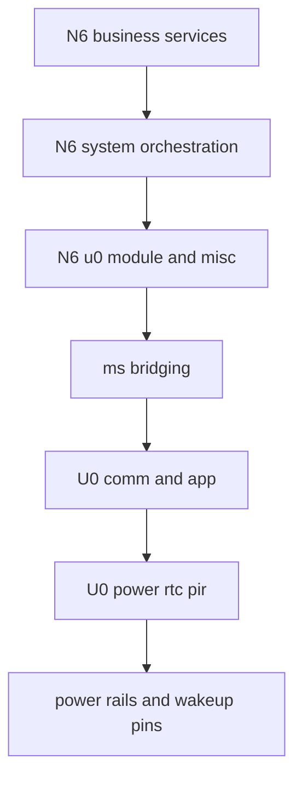
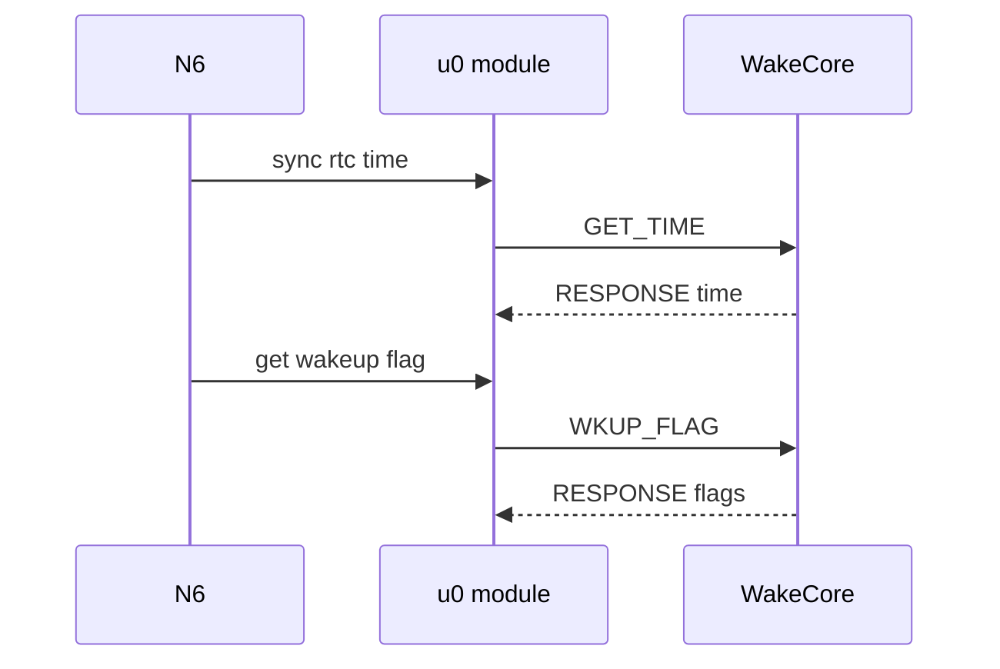
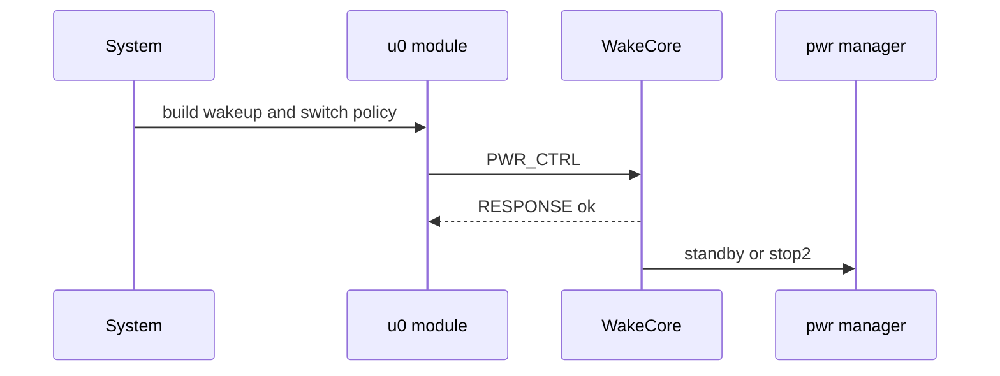
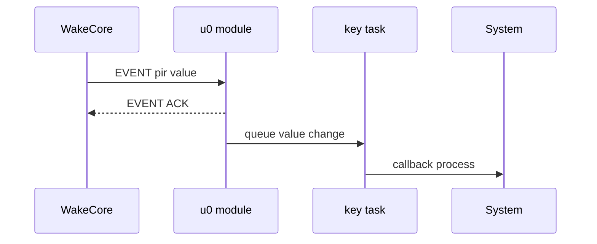
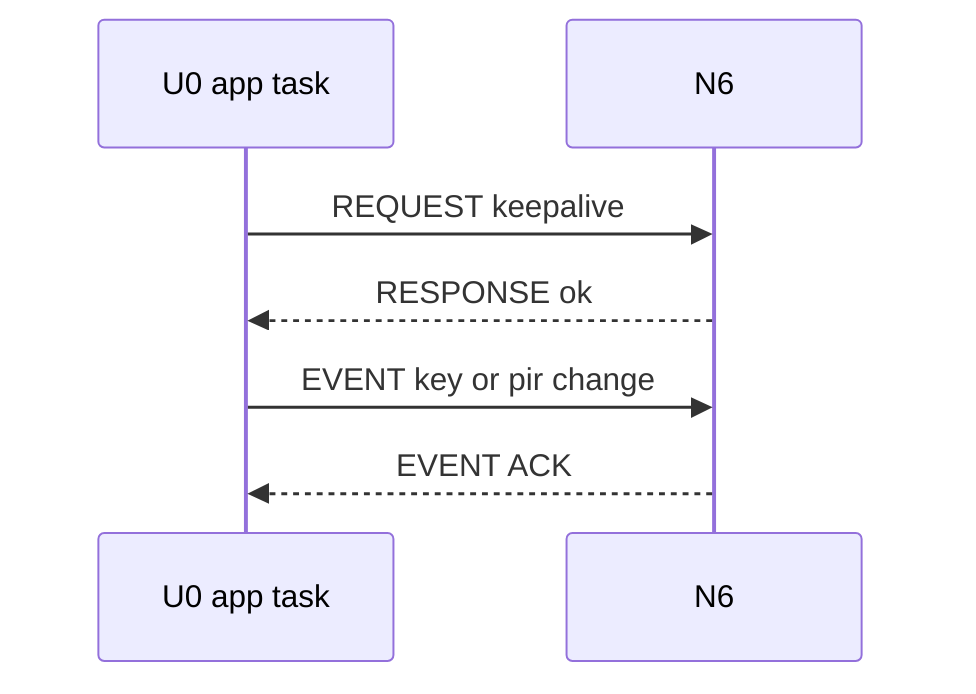

# NE301 U0 与 N6 双 MCU 通信与协议分析

## 1. 结论先行

NE301 当前的双 MCU 协同，不是共享内存模型，也不是简单 GPIO 握手，而是一套明确的：

- `UART9 <-> LPUART2` 物理链路
- `ms_bridging` 帧协议
- `N6 request response + U0 event ack` 双向消息模型

从职责上看：

- `N6` 是业务主控，负责系统策略、网络、AI、视频和睡眠策略声明
- `U0` 是常驻控制核，负责低功耗执行、电源域门控、RTC、按键、PIR 和唤醒源采集
- `ms_bridging` 是两边唯一明确的软件边界

这意味着双 MCU 通信不是附属功能，而是整机启动、运行、睡眠、唤醒闭环里的主链路之一。

## 2. 分析范围与证据来源

本分析基于当前仓库里的这些关键文件：

- `Custom/Hal/u0_module.c`
- `Custom/Hal/u0_module.h`
- `Custom/Common/Lib/ms_bridging/ms_bridging.c`
- `Custom/Common/Lib/ms_bridging/ms_bridging.h`
- `Custom/Hal/driver_core.c`
- `Custom/Hal/misc.c`
- `Custom/Services/System/system_service.c`
- `Appli/Core/Src/usart.c`
- `WakeCore/Custom/Components/n6_comm/n6_comm.c`
- `WakeCore/Custom/Components/n6_comm/n6_comm.h`
- `WakeCore/Custom/Components/ms_bridging/ms_bridging.c`
- `WakeCore/Custom/Components/ms_bridging/ms_bridging.h`
- `WakeCore/Custom/User/app.c`
- `WakeCore/Core/Src/usart.c`

说明：

- 文中凡是写“源码可见”的内容，来自上述文件
- 文中凡是写“推断”的内容，表示这是根据实现细节整理出来的工程结论，而不是某个单一文档直接声明

## 3. 软件分层与通信边界

### 3.1 分层总览图



这张图里的关键边界是：

- `N6` 业务层不直接碰底层串口协议
- `U0` 执行层不直接承载复杂业务
- 二者通过 `ms_bridging` 交换策略、状态和事件

### 3.2 各层职责与关键 API

| 层次 | 主要模块 | 关键 API | 职责 |
| --- | --- | --- | --- |
| N6 业务服务层 | `system_service`、`communication_service`、`mqtt_service`、`web_service` | `system_service_process_wakeup_event()`、`prepare_for_sleep()` | 决定醒来后做什么，决定这次睡眠策略 |
| N6 适配层 | `u0_module.c`、`misc.c` | `u0_module_sync_rtc_time()`、`u0_module_get_wakeup_flag()`、`u0_module_cfg_pir()`、`u0_module_enter_sleep_mode_ex()`、`u0_module_callback_process()` | 把 U0 封装成本地 HAL/Facade |
| 协议层 | `ms_bridging.c`、`ms_bridging.h` | `ms_bridging_request_*()`、`ms_bridging_send_event()`、`ms_bridging_event_ack()`、`ms_bridging_recv()`、`ms_bridging_polling()` | 负责帧封装、CRC、ACK、超时和重试 |
| U0 控制层 | `n6_comm_task`、`ms_bridging_polling_task`、`app_task` | `ms_bridging_notify_callback()`、`ms_bridging_request_keep_alive()`、`ms_bridging_event_key_value()` | 接收 N6 请求、监督 N6 在线状态、向 N6 回推事件 |
| U0 执行层 | `pwr_manager`、`pir`、`rtc`、`gpio` | `pwr_enter_standby()`、`pwr_enter_stop2()`、`pwr_ctrl_bits()`、`pwr_get_wakeup_flags()`、`pir_config()` | 真正执行低功耗、电源门控和唤醒源配置 |

可以压缩成一句话：

- `system_service` 决策
- `u0_module` 适配
- `ms_bridging` 通信
- `WakeCore` 执行

## 4. 物理链路与运行模型

### 4.1 物理链路

源码可见，当前双 MCU 互联的物理事实如下：

| 项目 | N6 侧 | U0 侧 |
| --- | --- | --- |
| 串口实例 | `UART9` | `LPUART2` |
| 波特率 | `115200` | `115200` |
| 格式 | `8N1` | `8N1` |
| 流控 | 无 | 无 |
| 接收方式 | `HAL_UARTEx_ReceiveToIdle_IT()` | `HAL_UARTEx_ReceiveToIdle_DMA()` |
| 发送方式 | `HAL_UART_Transmit_IT()` | `HAL_UART_Transmit_DMA()` |

所以从链路层看，NE301 当前就是一条专用 UART 控制通道。

### 4.2 两侧线程模型

| 位置 | 线程或任务 | 作用 |
| --- | --- | --- |
| N6 | `ms_bd_Task` | 轮询 `ms_bridging`，把收到的协议帧转成回调 |
| N6 | `keyTask` | 周期性调用 `u0_module_callback_process()`，把 U0 上报的 key PIR 变化转成本地回调 |
| U0 | `n6_comm_task` | 负责 `LPUART2` 收发和错误恢复 |
| U0 | `ms_bridging_polling_task` | 负责分发协议请求帧和事件帧 |
| U0 | `app_task` | 负责 keep alive、按键与 PIR 上报、N6 监督和睡眠前后协同 |

两端的职责明显不对称：

- `N6` 只需要一个较薄的适配层
- `U0` 需要常驻传输层、协议层和监督层

### 4.3 通信链路总览图


## 5. `u0_module` 在 N6 侧的角色

`u0_module` 不是简单的串口发包函数集合，它实际承担了 4 层职责：

1. 提供本地 API
- 例如 `u0_module_get_wakeup_flag()`、`u0_module_enter_sleep_mode_ex()`

2. 维护状态缓存
- `g_key_value`
- `g_pir_value`
- `g_power_status`
- `g_wakeup_flag`

3. 维护本地异步事件队列
- `value_change_event_queue`

4. 维护 N6 侧协议轮询线程
- `ms_bd_Task`

这让上层服务可以把 U0 看成一个“本地设备”，而不是一个“远端从机”。

## 6. `ms_bridging` 的通信语义

### 6.1 两种通信模式

当前协议实际支持两种语义：

| 模式 | 帧类型 | 当前主要方向 | 用途 |
| --- | --- | --- | --- |
| 同步请求应答 | `REQUEST` 和 `RESPONSE` | 主要是 `N6 -> U0`，少量 `U0 -> N6` | 读取状态、下发策略、执行控制 |
| 异步事件确认 | `EVENT` 和 `EVENT_ACK` | 主要是 `U0 -> N6` | 回推 key 和 PIR 变化 |

可以把它理解成：

- `REQUEST/RESPONSE` 更像 RPC
- `EVENT/EVENT_ACK` 更像带确认的异步通知

### 6.2 当前产品里谁主动发什么

| 发起方 | 主要动作 |
| --- | --- |
| `N6` | 获取时间、同步时间、读取唤醒标志、下发睡眠策略、读取按键/PIR/USB 状态、配置 PIR |
| `U0` | 对 N6 发 `KEEPLIVE`、回推 `KEY_VALUE` 和 `PIR_VALUE` 事件、在少量场景下请求 N6 版本 |

这说明 U0 并不只是“被 N6 调用”，它也会主动监督 N6 并回推本地输入事件。

## 7. 协议帧格式详细分析

### 7.1 帧结构

当前帧格式如下：

```text
SOF 1B | ID 2B | LEN 2B | TYPE 2B | CMD 2B | HEADER CRC 2B | DATA N B | DATA CRC 2B if LEN > 0
```

头部来自 `ms_bridging_frame_header_t`，在 `#pragma pack(1)` 下固定为 `11` 字节。

### 7.2 字段含义

| 字段 | 长度 | 含义 |
| --- | --- | --- |
| `sof` | 1 字节 | 固定起始字节 `0xBD` |
| `id` | 2 字节 | 帧序号，用于匹配 response 或 event ack |
| `len` | 2 字节 | 数据区长度 |
| `type` | 2 字节 | 帧类型 |
| `cmd` | 2 字节 | 命令字 |
| `crc` | 2 字节 | 头部 CRC |
| `data` | 变长 | 负载 |
| `data_crc` | 2 字节 | 数据区 CRC，仅在 `len > 0` 时存在 |

### 7.3 帧类型枚举

| 数值 | 类型 |
| --- | --- |
| `0` | `REQUEST` |
| `1` | `RESPONSE` |
| `2` | `EVENT` |
| `3` | `EVENT_ACK` |

### 7.4 CRC 实现

CRC 的实现特点如下：

- 算法是 `CRC16 CCITT`
- 多项式是 `0x1021`
- 初始值是 `0xFFFF`

头和数据区分别校验：

- 头部 CRC 覆盖 `header` 中除 CRC 自身外的字段
- 数据 CRC 只覆盖 `data`

### 7.5 字节序与可移植性

推断：

- 两端都对 packed struct 直接 `memcpy` 后发串口
- 两端 MCU 都是 `STM32`

所以当前协议实现本质上是：

- 小端字节序
- 同构 MCU 优化
- 结构体直传

这很高效，但它不是面向跨平台互联设计的协议。

## 8. 可靠性机制

### 8.1 当前实现的可靠性手段

| 机制 | 当前实现 |
| --- | --- |
| 帧完整性 | 头 CRC 和数据 CRC |
| 请求匹配 | `id + cmd + frame type` |
| 应答等待 | `ack_sem + ack_frame` |
| 异步分发 | `notify_sem + notify_frame` |
| 发送超时 | `MS_BR_FRAME_SEND_TIMEOUT_MS = 100` |
| ACK 超时 | `MS_BR_WAIT_ACK_TIMEOUT_MS = 500` |
| 轮询间隔 | `MS_BR_WAIT_ACK_DELAY_MS = 20` |
| 重试次数配置 | `MS_BR_RETRY_TIMES = 3` |
| 帧槽数 | `MS_BR_FRAME_BUF_NUM = 4` |
| 协议输入上限 | `MS_BR_BUF_MAX_SIZE = 512` |

### 8.2 重试语义

`ms_bridging_request()` 和 `ms_bridging_send_event()` 都采用 `do while` 结构。

所以当前 `MS_BR_RETRY_TIMES = 3` 的实际效果是：

- 首次发送 1 次
- 失败后再重试最多 3 次

也就是最多 4 次发送机会。

### 8.3 帧处理路径

协议接收路径可以概括为：

1. UART 收到字节流
2. `ms_bridging_recv()` 逐字节组帧
3. 完整帧后做 CRC 校验
4. `REQUEST` 和 `EVENT` 进入 `notify_frame`
5. `RESPONSE` 和 `EVENT_ACK` 进入 `ack_frame`
6. `ms_bridging_polling()` 轮询并分发 `notify_frame`
7. 等待中的请求通过 `ack_frame` 被唤醒

这也是为什么它既能支持同步 RPC，又能支持异步事件。

## 9. 命令字与负载结构

### 9.1 命令字枚举

| 数值 | 命令 |
| --- | --- |
| `0` | `KEEPLIVE` |
| `1` | `GET_TIME` |
| `2` | `SET_TIME` |
| `3` | `PWR_CTRL` |
| `4` | `PWR_STATUS` |
| `5` | `WKUP_FLAG` |
| `6` | `KEY_VALUE` |
| `7` | `PIR_VALUE` |
| `8` | `CLEAR_FLAG` |
| `9` | `RST_N6` |
| `10` | `PIR_CFG` |
| `11` | `USB_VIN_VALUE` |
| `12` | `GET_VERSION` |

### 9.2 低功耗相关的关键结构体

| 结构体 | 关键字段 | 作用 |
| --- | --- | --- |
| `ms_bridging_time_t` | `year month day week hour minute second` | U0 与 N6 RTC 时间同步 |
| `ms_bridging_alarm_t` | `is_valid week_day date hour minute second` | 描述 Alarm A 或 Alarm B |
| `ms_bridging_power_ctrl_t` | `power_mode switch_bits wakeup_flags sleep_second alarm_a alarm_b` | 一次完整睡眠策略 |
| `ms_bridging_pir_cfg_t` | `sensitivity_level ignore_time_s pulse_count window_time_s ...` | 描述 PIR 前端配置 |
| `ms_bridging_version_t` | `major minor patch build` | 固件版本 |

### 9.3 `power_mode` 取值

| 数值 | 含义 |
| --- | --- |
| `0` | `NORMAL` |
| `1` | `STANDBY` |
| `2` | `STOP2` |

其中 `ms_bridging_power_ctrl_t` 是整条低功耗控制链的核心，因为它一次性打包了：

- 这次想走哪种睡眠模式
- 这次保留哪些电源域
- 允许哪些唤醒源
- 睡多久
- 是否启用 Alarm A 与 Alarm B

## 10. API 到协议命令的映射

### 10.1 N6 本地 API 到 U0 协议命令

| N6 API | 协议命令 | 请求负载 | 响应负载 | U0 侧动作 |
| --- | --- | --- | --- | --- |
| `u0_module_sync_rtc_time()` | `GET_TIME` | 无 | `ms_bridging_time_t` | 读 U0 RTC |
| `u0_module_update_rtc_time()` | `SET_TIME` | `ms_bridging_time_t` | 无 | 写 U0 RTC |
| `u0_module_get_power_status()` | `PWR_STATUS` | 无 | `uint32_t` | 返回 `switch_bits` |
| `u0_module_get_wakeup_flag()` | `WKUP_FLAG` | 无 | `uint32_t` | 返回 `wakeup_flags` |
| `u0_module_clear_wakeup_flag()` | `CLEAR_FLAG` | 无 | 无 | 清除唤醒标志 |
| `u0_module_reset_chip_n6()` | `RST_N6` | 无 | 无 | 重启 N6 |
| `u0_module_get_key_value()` | `KEY_VALUE` | 无 | `uint32_t` | 读按键值 |
| `u0_module_get_pir_value()` | `PIR_VALUE` | 无 | `uint32_t` | 读 PIR 值 |
| `u0_module_get_usbin_value()` | `USB_VIN_VALUE` | 无 | `uint32_t` | 读 USB 供电状态 |
| `u0_module_get_version()` | `GET_VERSION` | 无 | `ms_bridging_version_t` | 返回 U0 版本 |
| `u0_module_cfg_pir()` | `PIR_CFG` | `ms_bridging_pir_cfg_t` | `uint32_t` | 配置 PIR |
| `u0_module_power_control()` | `PWR_CTRL` | `ms_bridging_power_ctrl_t` | 无 | 正常模式下切换电源域 |
| `u0_module_enter_sleep_mode_ex()` | `PWR_CTRL` | `ms_bridging_power_ctrl_t` | 无 | 进入 `Standby` 或 `Stop2` |

### 10.2 U0 主动发往 N6 的命令和事件

| 发起方 | 协议类型 | 命令 | 负载 | N6 侧行为 |
| --- | --- | --- | --- | --- |
| `U0 app_task` | `REQUEST` | `KEEPLIVE` | 无 | 立即回复，供 U0 监督 N6 在线状态 |
| `U0 notify` | `REQUEST` | `GET_VERSION` | 无 | 返回 N6 固件版本 |
| `U0 app_task` | `EVENT` | `KEY_VALUE` | `uint32_t` | 更新缓存并投递 `value_change_event_queue` |
| `U0 app_task` | `EVENT` | `PIR_VALUE` | `uint32_t` | 更新缓存并投递 `value_change_event_queue` |

## 11. 关键时序

### 11.1 启动后同步 RTC 和读取唤醒标志



这条链路的作用是：

- N6 先从 U0 恢复对时间和上次唤醒原因的认知
- 但并不立刻做业务动作
- 而是等服务起来后再统一处理

### 11.2 N6 下发一次睡眠策略



这条链路的本质是：

- `N6` 负责把“本次策略”编码成 `ms_bridging_power_ctrl_t`
- `U0` 负责把它翻译成真实的低功耗动作

### 11.3 U0 上报一次 PIR 变化



这条链路说明：

- U0 的本地输入变化不是直接打断 N6 业务
- 而是先转成本地队列事件，再交给 N6 现有输入框架处理

### 11.4 U0 对 N6 的在线监督



这也是为什么 U0 侧会有 `STARTUP`、`RUNNING`、`WAIT_REBOOT` 这些状态。

## 12. 设计思路分析

### 12.1 为什么不是直接共享状态

当前设计不采用共享内存或一堆 GPIO 信号，而是协议化通信，原因很明确：

- 双方边界清晰
- 命令和状态可扩展
- 唤醒原因、PIR 参数、Alarm、功耗策略都能统一编码
- 出问题时也更容易抓日志和复盘

### 12.2 为什么 `u0_module` 很重要

如果没有 `u0_module` 这一层：

- `system_service` 需要自己拼协议帧
- `misc` 需要自己知道 `KEY_VALUE` 和 `PIR_VALUE` 事件细节
- 上层所有模块都会被双 MCU 实现细节污染

有了 `u0_module` 之后：

- 上层只知道“这是一个本地设备接口”
- 底层协议可以继续演进

### 12.3 为什么事件要先排队再处理

N6 侧的 `KEY_VALUE` 和 `PIR_VALUE` 事件没有在协议回调里直接做业务处理，而是先：

- 更新缓存
- 放入 `value_change_event_queue`
- 再由 `keyTask` 定期调用 `u0_module_callback_process()`

这背后的设计思路是：

- 串口回调尽量短
- 输入事件复用本地输入框架
- 避免在串口上下文里直接触发复杂业务逻辑

### 12.4 为什么 U0 会主动发 `KEEPLIVE`

这反映了一个关键定位：

- `U0` 不是完全被动的从机
- 它也是整机控制面的监督者

所以它会主动确认：

- N6 是否已经拉起
- N6 是否还在线
- 睡眠前后是否需要重建链路

## 13. 协议的软件设计实现分析

### 13.1 这套协议在软件里是如何分层落地的

从代码实现看，协议落地不是一个大文件包办，而是拆成了 5 个彼此解耦的实现层：

| 层次 | 主要代码 | 设计作用 |
| --- | --- | --- |
| 协议核心层 | `ms_bridging.c` | 负责帧格式、CRC、ACK、超时、重试、命令分发 |
| 传输绑定层 | `u0_module_send_func()`、`n6_comm_send()`、UART 回调 | 把协议核心挂到具体串口驱动上 |
| 本地 Facade 层 | `u0_module_*` | 给 N6 上层提供本地 API，不暴露协议细节 |
| 事件适配层 | `value_change_event_queue`、`u0_module_callback_process()` | 把 U0 上报事件转成 N6 本地输入事件 |
| U0 执行层 | `ms_bridging_notify_callback()`、`app_task`、`pwr_manager` | 把协议命令变成真实控制动作 |

这套切法的价值在于：

- `ms_bridging` 本身不需要知道 UART9 还是 LPUART2
- `system_service` 不需要知道帧头、CRC 和 ACK
- `pwr_manager` 不需要知道命令字编号

### 13.2 `ms_bridging` 核心是如何设计的

`ms_bridging_handler_t` 基本上就是这套协议运行时的中心对象，它至少维护了：

- `global_frame_id`
- `input_frame`
- `ack_frame[4]`
- `notify_frame[4]`
- `send_func`
- `notify_cb`
- `ack_sem`
- `notify_sem`

围绕它，协议核心层形成了 4 条固定路径：

1. 发送路径
- `ms_bridging_build_frame()`
- `ms_bridging_calculate_frame_crc()`
- `ms_bridging_send_frame()`

2. 接收路径
- `ms_bridging_recv()`
- `ms_bridging_check_frame_crc()`
- `ms_bridging_deal_input_frame()`

3. 同步请求路径
- `ms_bridging_request()`
- `ms_bridging_wait_for_ack()`

4. 异步事件路径
- `ms_bridging_send_event()`
- `ms_bridging_event_ack()`
- `ms_bridging_polling()`

这个设计有两个很重要的特点：

1. 协议核心只抽象了两个外部依赖
- `send_func`
- `notify_cb`

2. 除了时间、内存和可选信号量宏之外
- 它几乎不关心平台细节

这也是它相对容易移植的根本原因。

### 13.3 N6 侧的软件实现是如何落地的

N6 侧的核心实现不在 `system_service`，而在 `u0_module_register()` 这条初始化链。

#### N6 初始化链

`driver_core_init()` 很早就调用：

- `u0_module_register()`

而 `u0_module_register()` 自己完成了这些动作：

1. 创建 `u0_tx_mutex`
2. 创建 `value_change_event_queue`
3. 调 `ms_bridging_init(u0_module_send_func, u0_module_notify_cb)`
4. 初始化 `UART9`
5. 启动 `HAL_UARTEx_ReceiveToIdle_IT()`
6. 创建 `ms_bd_Task`
7. 注册调试命令入口

这说明 `u0_module` 不是一个纯静态库，而是一个带运行时对象、线程和队列的适配模块。

#### N6 接收路径

N6 侧接收链路是：

1. `UART9` 收到数据并触发 `HAL_UART9_RxEventCallback()`
2. 回调把字节流喂给 `ms_bridging_recv()`
3. `ms_bd_Task` 持续调用 `ms_bridging_polling()`
4. 轮询到完整 `REQUEST` 或 `EVENT` 后，调用 `u0_module_notify_cb()`

这里最值得注意的是：

- 中断回调只负责把数据塞给协议核心
- 真正业务语义处理发生在轮询线程

这是典型的“中断收包，线程分发”设计。

#### N6 发送路径

N6 侧发送链路是：

1. 上层调 `u0_module_*`
2. `u0_module_*` 调 `ms_bridging_request_*()`
3. `ms_bridging_request_*()` 调 `u0_module_send_func()`
4. `u0_module_send_func()` 通过 `HAL_UART_Transmit_IT()` 发串口
5. 再轮询 `huart9.gState` 等待发送完成

这条链路说明：

- 对上层 API 来说，它是同步接口
- 对底层 UART 来说，它其实是“中断发送 + 轮询等待完成”

#### N6 事件适配路径

当 U0 主动发 `KEY_VALUE` 或 `PIR_VALUE` 事件时，N6 不直接在 `u0_module_notify_cb()` 里做复杂业务，而是：

1. 更新本地缓存
2. 投递 `value_change_event_queue`
3. 回 `EVENT_ACK`
4. 再由 `keyTask` 周期性调用 `u0_module_callback_process()`
5. 最后转成 `g_key_value_change_cb` 或 `g_pir_value_change_cb`

这其实是一个非常典型的“协议事件 -> 本地事件总线”的桥接设计。

#### N6 上层如何使用这条通道

当前最关键的两个上层接入点是：

- `system_service`
- `misc`

`system_service` 负责：

- 启动时 `sync rtc`
- 读取 `wakeup flag`
- 入睡前下发 `PIR_CFG`
- 入睡时下发 `PWR_CTRL`

`misc` 则负责：

- 在 `keyTask` 中周期性调用 `u0_module_callback_process()`
- 把来自 U0 的按键与 PIR 变化接回本地输入框架

### 13.4 U0 侧的软件实现是如何落地的

U0 侧实现比 N6 更重，因为它承担的是常驻控制职责。

#### U0 初始化链

U0 启动后，`StartDefaultTask()` 调用 `app_init()`，而 `app_init()` 会做这些动作：

1. 读 `pwr_get_wakeup_flags()`
2. 必要时 `pwr_wait_for_key_release()`
3. 恢复默认电源域 `PWR_DEFAULT_SWITCH_BITS`
4. 初始化 `n6_comm`
5. 注册 `n6_comm_recv_callback`
6. 创建 `app_task_event`
7. 调 `ms_bridging_init(n6_comm_send, ms_bridging_notify_callback)`
8. 创建 `ms_bridging_polling_task`
9. 创建 `app_task`

所以 U0 侧是一个完整的“传输层 + 协议层 + 监督层”三层常驻架构。

#### U0 接收与分发链

U0 侧接收链路是：

1. `n6_comm_task` 通过 `HAL_UARTEx_ReceiveToIdle_DMA()` 挂起接收
2. UART 收完一帧后通过 `EventGroup` 通知 `RX_DONE`
3. `n6_comm_task` 调 `n6_comm_recv_callback()`
4. `n6_comm_recv_callback()` 把数据喂给 `ms_bridging_recv()`
5. `ms_bridging_polling_task` 调 `ms_bridging_polling()`
6. 最终进入 `ms_bridging_notify_callback()`

因此 U0 侧把：

- 传输可靠性
- 帧协议语义
- 功能命令执行

分成了三个独立责任层。

#### U0 控制执行链

当前最重要的命令执行入口就是：

- `ms_bridging_notify_callback()`

它负责把：

- `GET_TIME`
- `SET_TIME`
- `PWR_CTRL`
- `PWR_STATUS`
- `WKUP_FLAG`
- `CLEAR_FLAG`
- `RST_N6`
- `KEY_VALUE`
- `PIR_VALUE`
- `USB_VIN_VALUE`
- `PIR_CFG`
- `GET_VERSION`

映射到具体平台动作。

这一步之后，真正执行硬件控制的是：

- `pwr_manager`
- `pir`
- `rtc`
- `gpio`

所以协议层本身并不碰电源寄存器，它只是分发器。

#### U0 的监督与恢复逻辑

除了命令分发，U0 还有一个 `app_task` 状态机，负责：

- `KEEPLIVE`
- key 和 PIR 变化检测
- 睡眠前后停机和重启协同
- N6 失联后的重启恢复

这个状态机让 U0 不只是一个“命令执行器”，而是一个“常驻监督控制器”。

### 13.5 这套实现为什么工程上比较稳

结合两侧实现，可以看出它有 5 个比较稳的设计点：

1. 中断路径很短
- 两边都尽量不在中断或 DMA 邻近上下文里做复杂业务

2. 上层 API 是同步的
- `u0_module_*` 对 `system_service` 来说很好用

3. 下行控制和上行事件分开
- 控制靠 `REQUEST/RESPONSE`
- 事件靠 `EVENT/EVENT_ACK`

4. U0 本地监督独立存在
- 即使 N6 异常，U0 仍可维持控制面闭环

5. 协议核心与平台绑定是分开的
- 这让代码既容易维护，也更容易移植

## 14. 如何移植这套协议

### 14.1 最小可移植单元是什么

如果你想把这套通信协议移植到别的平台，最小可移植单元其实不是 `u0_module`，而是：

- `ms_bridging.c`
- `ms_bridging.h`

因为：

- `ms_bridging` 是协议核心
- `u0_module` 和 `n6_comm` 都是具体平台接入层

所以建议的移植拆分方式是：

1. 先移植 `ms_bridging`
2. 再移植 transport binding
3. 最后移植 N6/U0 两侧业务适配

### 14.2 第一步：移植协议核心层

协议核心层移植时，最先要替换的是 `ms_bridging.h` 里的平台宏：

| 宏 | 当前作用 |
| --- | --- |
| `MS_BR_MALLOC` | 分配内存 |
| `MS_BR_FREE` | 释放内存 |
| `MS_BR_GET_TICK_MS` | 获取毫秒 tick |
| `MS_BR_TICK_DIFF_MS` | 计算 tick 差值 |
| `MS_BR_DELAY_MS` | 延时 |
| `MS_BR_SEM_CREATE` | 创建信号量 |
| `MS_BR_SEM_DELETE` | 删除信号量 |
| `MS_BR_SEM_WAIT` | 等待信号量 |
| `MS_BR_SEM_POST` | 释放信号量 |

当前仓库里两侧已经是不同实现：

- N6 侧使用 `hal_mem_alloc_large()` 和 `CMSIS-RTOS2` 信号量
- U0 侧使用 `pvPortMalloc()` 和 `CMSIS-RTOS2` 风格宏映射

这本身就说明协议核心已经被设计成“可以按平台替换基础依赖”。

### 14.3 第二步：移植传输绑定层

协议核心移植完后，第二步是让它接到具体链路上。

必须完成的事情只有 3 件：

1. 实现 `send_func`
- 能把一个完整缓冲区按原样发出去

2. 在底层接收回调里调用 `ms_bridging_recv()`
- 把收到的字节流持续喂给协议核心

3. 周期性调用 `ms_bridging_polling()`
- 让 `notify_frame` 被分发，`ack_frame` 被清理

因此 transport 不一定非得是 UART，也可以换成：

- SPI
- USB CDC
- RS485
- 片上 mailbox

只要满足“可靠字节流 + 一端能主动推送”这两个条件即可。

### 14.4 第三步：移植 N6 侧这种主控接入模式

如果目标平台也想扮演当前 N6 的角色，建议按现在的 `u0_module` 方式移植，而不是让业务层直接调协议核心。

推荐保留的层次是：

1. Facade API
- 例如 `get_time`
- `get_wakeup_flag`
- `cfg_pir`
- `enter_sleep_mode`

2. 本地状态缓存
- key
- pir
- wakeup flag
- power status

3. 本地事件队列
- 把远端异步事件转成本地输入事件

4. 后台协议轮询线程
- 专门调用 `ms_bridging_polling()`

这样上层业务就可以继续把远端协处理器当成本地设备来用。

### 14.5 第四步：移植 U0 侧这种执行控制模式

如果目标平台想扮演当前 U0 的角色，移植重点不是协议本身，而是“命令执行器和监督器”。

至少需要落地这三块：

1. 命令分发表
- 把 `GET_TIME`、`PWR_CTRL`、`PIR_CFG` 等命令映射到本地动作

2. 平台执行后端
- RTC
- 电源控制
- PIR 配置
- 按键和唤醒源读取

3. 监督状态机
- keep alive
- 本地事件上报
- 睡眠前后协同
- 对主控异常的恢复

如果只移植协议分发，不移植监督逻辑，那你得到的只是一个“远端命令执行器”，而不是当前这种完整的低功耗控制核。

### 14.6 移植到不同 RTOS 或裸机时怎么做

当前实现并不强依赖某一个 RTOS，但它依赖这些能力：

- 互斥
- 信号量
- 线程或主循环轮询
- 毫秒 tick
- 延时

#### 移植到其他 RTOS

只需要把这些对象映射到本平台等价物：

- `osMutex`
- `osSemaphore`
- `osThread`
- `osMessageQueue`
- `osEventFlags`
- `EventGroup`

#### 移植到裸机

也是可行的，但建议这么做：

1. 用轮询主循环替代 `ms_bridging_polling_task`
2. 用环形队列替代消息队列
3. 用忙等或轻量状态机替代信号量
4. 仍然保留 `send_func + recv + polling` 这三个核心钩子

`ms_bridging.c` 本身对信号量是有条件编译判断的，所以做纯轮询移植并非不可行。

### 14.7 移植到异构 CPU 或不同 ABI 时必须注意什么

如果目标不再是两端都为 `STM32` 的同构环境，必须重点处理 4 个问题：

1. 字节序
- 当前实现默认小端

2. 结构体对齐
- 当前依赖 `#pragma pack(1)`

3. 基本类型宽度
- 当前默认 `uint16_t`、`uint32_t` 布局完全一致

4. 协议版本
- 当前命令和 payload 没有独立版本字段

所以一旦跨到异构平台，建议直接做这两件事：

- 不再直接 `memcpy` 结构体发送
- 给关键 payload 增加显式序列化和版本控制

### 14.8 推荐的移植步骤

建议按下面顺序做，而不要一上来就把整套业务一起搬过去：

1. 先把 `ms_bridging` 核心单独跑通
2. 跑通 `GET_VERSION` 这种最简单的请求应答
3. 跑通 `KEY_VALUE` 这种最简单的事件 ACK
4. 再接 `GET_TIME` 和 `SET_TIME`
5. 再接 `WKUP_FLAG` 和 `PWR_STATUS`
6. 最后再接 `PWR_CTRL`、`PIR_CFG` 这类真正会改系统状态的命令

这个顺序能显著降低调试复杂度，因为：

- 你先验证传输层
- 再验证协议层
- 最后才验证真正有副作用的控制动作

### 14.9 一份最小移植检查清单

在真正开始移植前，建议先确认下面这些项：

| 检查项 | 是否必须 |
| --- | --- |
| 有稳定的全双工或等效双向字节流通道 | 必须 |
| 有毫秒级 tick | 必须 |
| 有可替代的内存分配器 | 必须 |
| 有定时轮询点或后台线程 | 必须 |
| 有互斥或等价发送保护 | 强烈建议 |
| 有异步事件缓存机制 | 强烈建议 |
| 能保证两端 payload 序列化一致 | 必须 |
| 能定义未知命令和版本升级策略 | 强烈建议 |

## 15. 当前实现边界与风险点

### 15.1 unknown cmd 没有标准错误响应

当前两侧 `notify callback` 对未识别命令通常只是忽略或记录日志，没有统一返回错误码。

结果是：

- 发起方通常等到超时
- 而不是收到一个明确的失败响应

### 15.2 协议是小端直传实现

当前 packed struct 直传很省事，但有代价：

- 字节序不自描述
- 结构体布局强依赖两端实现一致
- 可移植性不高

### 15.3 帧槽和缓冲都比较轻量

当前实现是轻量化的：

- `ack_frame` 4 槽
- `notify_frame` 4 槽
- 协议输入上限 `512`

这对当前低频控制流量足够，但不适合高吞吐消息场景。

### 15.4 N6 侧发送路径仍有轮询等待

N6 侧发送采用：

- `HAL_UART_Transmit_IT()`
- 再轮询 `huart9.gState`

它不是最彻底的事件驱动，但考虑到当前命令流量很低，工程上是可以接受的。

### 15.5 一个和协议 payload 直接相关的实现点

`Custom/Hal/u0_module.c` 中，`u0_module_enter_sleep_mode_ex()` 拷贝 `alarm_b` 时有一处：

- `power_ctrl.alarm_a.hour = rtc_alarm_b->hour`

这很像明显笔误，按语义应当是：

- `power_ctrl.alarm_b.hour = rtc_alarm_b->hour`

这个问题不是协议定义错误，而是 payload 组包实现值得复核。

## 16. 最终判断

NE301 当前的双 MCU 通信设计可以概括为：

1. 物理上
- 专用 UART 通道，`UART9 <-> LPUART2`

2. 软件上
- `u0_module` 把远端 U0 包装成本地设备
- `ms_bridging` 提供轻量级 RPC 和事件机制
- `WakeCore` 负责真正执行控制命令

3. 协议上
- 带 CRC
- 带 ACK
- 有重试
- 同时支持请求应答和异步事件

4. 产品定位上
- 它不是通用总线协议
- 而是一套围绕低功耗控制场景定制出来的专用桥接协议

如果后续还要继续完善这部分，我建议优先沿这三条线展开：

- 给 unknown cmd 增加统一错误响应
- 明确协议字节序和 payload 版本策略
- 给 `PWR_CTRL`、`PIR_CFG`、`WKUP_FLAG` 这些关键命令补正式协议文档和测试用例
