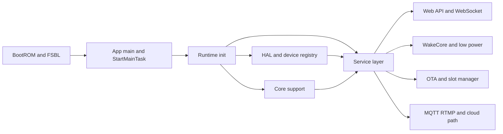
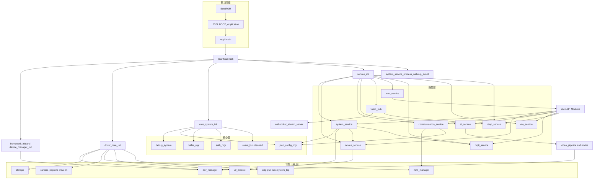
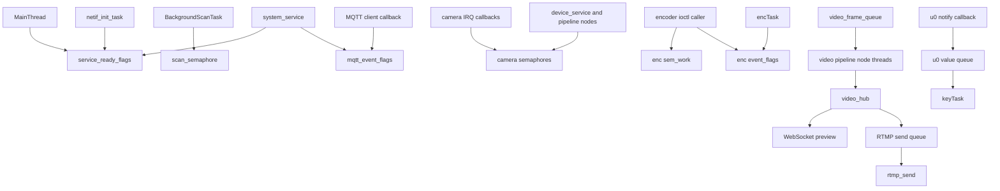
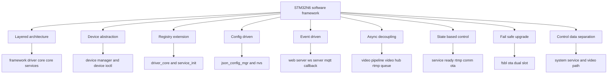
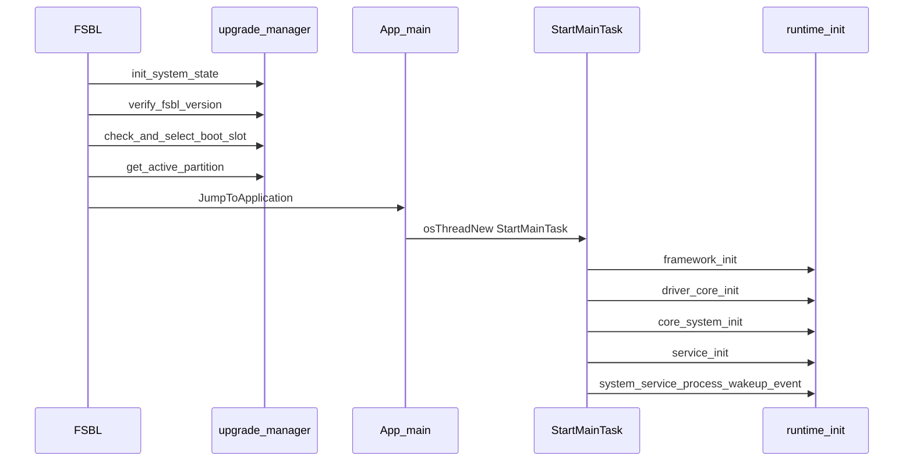
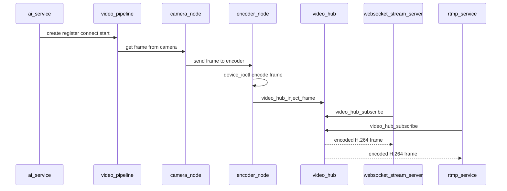
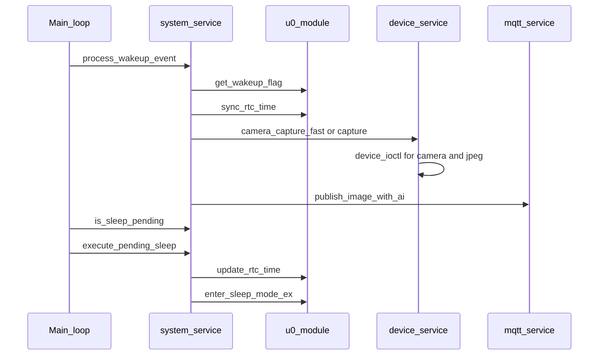
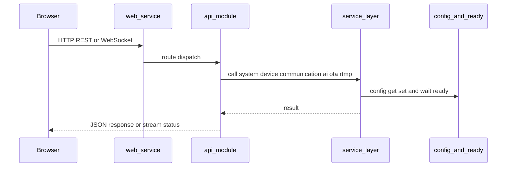

# NE301 STM32N6 软件框架梳理

## 1. 范围

本文只覆盖 `STM32N6` 主控侧的软件框架，重点是：

- 启动链路：`FSBL -> App`
- 运行时分层：`framework -> driver_core -> core_system -> service_init`
- 关键数据/控制路径：视频预览、AI 推理、低功耗唤醒、MQTT 上传、OTA
- 每层之间实际使用的 API

不展开的内容：

- `WakeCore/` 内部实现细节，只描述它与 N6 的接口边界
- `Web/` 前端源码实现细节，只描述 N6 侧如何承载和提供 Web 能力

## 2. 一句话结论

这个项目在 STM32N6 侧的真实主干不是 README 里的概念图，而是下面这条实际代码路径：

`BootROM -> FSBL(main/boot) -> Appli/Core/Src/main.c -> framework_init() -> driver_core_init() -> core_system_init() -> service_init() -> system_service_process_wakeup_event()`

其中真正最关键的层间边界只有 6 类：

1. 启动边界：`BOOT_Application()` / `JumpToApplication()`
2. 设备抽象边界：`device_register()` / `device_find_pattern()` / `device_ioctl()`
3. 核心配置边界：`json_config_get_*()` / `json_config_set_*()`
4. 服务调度边界：`service_init()` / `service_wait_for_ready()` / `service_set_*_ready()`
5. 视频流边界：`video_pipeline_*()` / `video_hub_*()`
6. 低功耗与辅核边界：`u0_module_*()`

## 3. 目录映射

| 目录 | 作用 | 备注 |
| --- | --- | --- |
| `FSBL/` | STM32N6 一阶段引导 | 负责分区选择、搬运 App、跳转 |
| `Appli/` | STM32N6 主应用入口 | `main.c` 创建主任务并串起初始化 |
| `Custom/Hal/` | 设备/外设抽象 | camera、jpeg、enc、nn、storage、netif、u0 等 |
| `Custom/Core/` | 核心公共能力 | config、buffer、auth、debug、event bus、video pipeline |
| `Custom/Services/` | 业务服务层 | system/device/communication/ai/web/mqtt/ota/rtmp/video_hub |
| `Web/` | 前端工程 | 最终打包成静态资源，由 N6 侧 HTTP 服务提供 |

## 4. 整体框架图

### 4.1 概括框图

这张图只保留 STM32N6 侧最核心的 6 个层次，用来先抓主干。

### 4.2 详细框图

## 5. 分层说明

### 5.1 Boot / FSBL 层

职责：

- 初始化最小运行环境、XSPI NOR/PSRAM 映射
- 从 A/B 分区选择有效 App
- 将 App 从外部 Flash 搬运到运行区
- 跳转到 App 向量表

关键 API：

- `BOOT_Application()`
- `CopyApplication()`
- `JumpToApplication()`
- `init_system_state()`
- `verify_fsbl_version()`
- `check_and_select_boot_slot(FIRMWARE_APP)`
- `get_active_partition(FIRMWARE_APP)`

### 5.2 App 启动编排层

职责：

- 创建主任务并按顺序初始化整套运行时
- 做平台时钟、NPU RAM、PSRAM/NOR、RIF/IAC 初始化
- 启动后处理唤醒事件，运行期轮询睡眠请求

关键 API：

- `framework_init()`
- `driver_core_init()`
- `core_system_init()`
- `service_init()`
- `system_service_process_wakeup_event()`
- `system_service_is_sleep_pending()`
- `system_service_execute_pending_sleep()`

### 5.3 Framework / Device Registry 层

职责：

- 用一个全局 `mutex` 把设备管理器保护起来
- 给上层提供统一的设备发现和控制入口

关键 API：

- `device_manager_init(lock, unlock)`
- `device_register(device_t *)`
- `device_find_pattern(const char *pattern, dev_type_t type)`
- `device_open()/device_start()/device_stop()`
- `device_ioctl(device_t *, cmd, buf, arg)`

说明：

- 这一层是整个工程最重要的“统一驱动入口”。
- 上层服务并不直接调用大多数 HAL 函数，而是通过 `device_find_pattern + device_ioctl` 间接访问设备。

### 5.4 HAL / Device 层

职责：

- 把摄像头、编码器、JPEG、NPU、存储、网络、U0 辅核、电源等都封装成 `device_t`
- 提供命令式控制接口给服务层和视频节点使用

代表模块与接口：

- Camera: `CAM_CMD_GET_PIPE1_BUFFER_WITH_FRAME_ID`, `CAM_CMD_GET_PIPE2_BUFFER`, `CAM_CMD_SET_PIPE_CTRL`
- JPEG: `JPEGC_CMD_INPUT_ENC_BUFFER`, `JPEGC_CMD_OUTPUT_ENC_BUFFER`, `JPEGC_CMD_RETURN_ENC_BUFFER`
- Encoder: `ENC_CMD_INPUT_BUFFER`, `ENC_CMD_OUTPUT_FRAME`, `ENC_CMD_SET_PARAM`
- NN: `nn_load_model()`, `nn_inference_frame()`, `nn_get_model_info()`
- Storage: `storage_nvs_read/write/flush_all()`, `storage_flash_read/write/erase()`
- Network: `nm_get_netif_cfg()`, `nm_set_netif_cfg()`, `nm_ctrl_netif_up/down()`, `nm_wireless_update_scan_result()`
- U0 bridge: `u0_module_get_wakeup_flag()`, `u0_module_sync_rtc_time()`, `u0_module_enter_sleep_mode_ex()`

### 5.5 Core 层

职责：

- 提供业务无关的公共能力：日志、配置、buffer、鉴权
- 为服务层提供基础数据和配置中心

关键 API：

- `debug_system_init()/deinit()`
- `json_config_mgr_init()/deinit()`
- `json_config_get_*()/json_config_set_*()`
- `buffer_mgr_init()/buffer_calloc()/buffer_free()`
- `auth_mgr_init()`
- `event_bus_*()`（接口完整，但当前 `core_system_init()` 没有真正启用）

现状备注：

- `event_bus_init()` 在 `core_system_init()` 中被注释掉，属于“设计在、运行时未打开”的能力。
- `timer_mgr` 也只保留 ready 标记，尚未按 `TODO` 完整初始化。

### 5.6 Service 层

职责：

- 按优先级注册、初始化、启动业务服务
- 维护服务状态机与 ready flags
- 在低功耗模式下决定哪些服务属于“必须启动”

关键 API：

- `service_init()/start()/stop()/deinit()`
- `service_register_module()`
- `service_start_module()/service_stop_module()`
- `service_wait_for_ready()`
- `service_set_ap_ready()`
- `service_set_sta_ready()`
- `service_set_mqtt_net_connected()`

默认注册的服务：

- `communication_service`
- `ai_service`
- `device_service`
- `video_hub`
- `mqtt_service`
- `system_service`
- `web_service`
- `ota_service`
- `rtmp_service`

### 5.7 Web / API 适配层

职责：

- HTTP Server 承载 Web UI 与 REST API
- WebSocket 承载预览视频流
- 把前端请求翻译成各类 `*_service_*` 调用

关键 API：

- `http_server_init()/start()/stop()`
- `api_gateway_init()`
- `http_server_register_route()`
- `websocket_stream_server_init()/start()/start_stream()/stop_stream()`
- `websocket_stream_server_subscribe_hub()/unsubscribe_hub()`

代表 API 模块与下层映射：

- `api_ai_management_module` -> `ai_*()`
- `api_device_module` -> `device_service_*()`
- `api_work_mode_module` -> `system_service_*()`
- `api_network_module` -> `communication_*()`
- `api_mqtt_module` -> `mqtt_service_*()`
- `api_ota_module` -> `ota_*()`
- `api_rtmp_module` -> `rtmp_service_*()`
- `api_preview_module` -> `websocket_stream_server_*()` + `ai_pipeline_*()`

### 5.8 RTOS、线程与通信机制

#### 5.8.1 RTOS 结论

- `STM32N6 App` 侧使用的是 `CMSIS-RTOS2` 编程接口，底层内核是 `ThreadX`
- 直接证据有 3 个：
  - `ne301.ioc` 里启用了 `THREADX`
  - `Middlewares/ST/cmsis_rtos_threadx/README.md` 明确说明这是“基于 ThreadX RTOS APIs 的 CMSIS-RTOS2 wrapper”
  - 实际启动入口 `Appli/Core/Src/main.c` 走的是 `osKernelInitialize() -> osThreadNew(StartMainTask) -> osKernelStart()`
- 这意味着当前工程不是“应用层直接写 `tx_thread_create()` 的原生 ThreadX 工程”，而是“应用层写 CMSIS-RTOS2，底层由 ThreadX 承载”

需要特别注意：

- `Appli/Core/Src/app_threadx.c` 和 `MX_ThreadX_Init()` 虽然存在，但当前主路径没有调用它
- 所以运行时应按 `main.c` 的 `CMSIS-RTOS2` 路径理解，而不是按 Cube 生成的 `MX_ThreadX_Init()` 理解
- 这个工程几乎不用 `osThreadFlags*()`，主要用的是 `osEventFlags`、`osMessageQueue`、`osSemaphore`、`osMutex`
- 这也和 `cmsis_rtos_threadx/README.md` 一致：该 wrapper 对 `Thread Flags` 标成了不支持

#### 5.8.2 应用层长期线程

这一层是你看系统行为时最应该先关注的线程。

| 线程名 | 创建位置 | 优先级 | 生命周期 | 主要职责 |
| --- | --- | --- | --- | --- |
| `MainThread` | `Appli/Core/Src/main.c` | `osPriorityNormal` | 开机后常驻 | 串起 `framework_init/driver_core_init/core_system_init/service_init`，然后轮询 `system_service_is_sleep_pending()` |
| `debugTask` | `Custom/Core/Log/debug.c` | `osPriorityHigh7` | `debug_system_init()` 后常驻 | 命令行、日志输出、驱动调试命令注册 |
| `BackgroundScanTask` | `Custom/Services/Communication/communication_service.c` | `osPriorityBelowNormal` | `communication_service_start()` 后常驻 | 等待扫描信号量，被触发后执行网络扫描 |
| `MQTTConnect` | `Custom/Services/MQTT/mqtt_service.c` | `osPriorityNormal` | `mqtt_service_start()` 后常驻，停止服务时销毁 | 等待 `SERVICE_READY_STA`，自动连接/重连 MQTT |
| `web_server` | `Custom/Services/Web/web_server.c` | `osPriorityRealtime` | `web_service_start()` 后常驻 | `mg_mgr_poll()` 驱动 HTTP/REST/API 网关 |
| `web_server_ap_sleep_timer` | `Custom/Services/Web/web_server.c` | `osPriorityNormal` | `web_service_start()` 后常驻 | AP 空闲超时、OTA 上传超时检查 |
| `ws_stream_server` | `Custom/Services/Web/websocket_stream_server.c` | 缺省配置为 `osPriorityRealtime` | `websocket_stream_server_start()` 后常驻 | WebSocket 连接管理、ping/pong、浏览器预览通道 |
| `rtmp_send` | `Custom/Services/RTMP/rtmp_service.c` | `osPriorityNormal` | 仅在 `rtmp_service_start_stream()` 且异步推流时存在 | 从队列取编码帧并发送到 RTMP 服务端 |

补充判断：

- `system_service`、`device_service`、`web_service` 本身更像“服务对象/接口集合”，并不是每个 service 都对应一个独立线程
- 也就是说，这个工程是“少量控制面线程 + 大量同步 API 调用 + 若干数据面 worker”的模型，不是“每个 service 一个任务”的模型

#### 5.8.3 视频数据面动态线程

`ai_service` 自己不是一个常驻大循环线程。真正开始预览/推理时，它会通过 `video_pipeline_start()` 展开成多个 node 线程。

| 线程名 | 创建来源 | 何时出现 | 主要职责 |
| --- | --- | --- | --- |
| `CameraPipelineCamera` | `ai_service.c` -> `video_camera_node_create()` -> `video_pipeline_start()` | AI pipeline 启动时 | 从 camera 设备取帧，形成视频数据源 |
| `CameraPipelineEncoder` | `ai_service.c` -> `video_encoder_node_create()` -> `video_pipeline_start()` | AI pipeline 启动时 | 调用 encoder 设备编码 H.264，并把结果注入 `video_hub` |
| `AIPipelineAI` | `ai_service.c` -> `video_ai_node_create()` -> `video_pipeline_start()` | AI pipeline 启动时 | 做 AI 推理、结果缓存、绘制相关处理 |

这一层的关键点是：

- 线程不是固定写死在 `ai_service` 里，而是由 `video_pipeline` 按 node 动态创建
- node 之间并不是直接函数调用，而是通过 `video_frame_queue` 传递帧
- 每个 node 的输出队列用的是 `mutex + not_empty_sem + not_full_sem`

#### 5.8.4 驱动与后台 worker 线程

这些线程不直接代表业务 service，但会明显影响时序、吞吐和低功耗行为。

| 线程名 | 创建位置 | 优先级 | 主要职责 | 典型同步机制 |
| --- | --- | --- | --- | --- |
| `cameraTask` | `Custom/Hal/camera.c` | `osPriorityNormal` | 相机初始化、ISP 背景处理、pipe buffer 生命周期 | `sem_isp`、`sem_pipe1`、`sem_pipe2`、`mtx_id` |
| `encTask` | `Custom/Hal/enc.c` | `osPriorityRealtime` | 编码器实际工作线程 | `sem_work` + `evt_flags` |
| `rtcTask` | `Custom/Hal/drtc.c` | `osPriorityNormal` | RTC 调度器事件处理 | `sem_sched1`、`sem_sched2` |
| `nvsSyncTask` | `Custom/Hal/storage.c` | `osPriorityBelowNormal` | 异步刷写 NVS，避免业务线程直接刷盘 | `nvs_sync_sem` + 周期 timer |
| `storageTask` | `Custom/Hal/storage.c` | `osPriorityNormal` | storage 模块保留 worker | `sem_id` |
| `keyTask` | `Custom/Hal/misc.c` | `osPriorityNormal` | 按键扫描，同时顺带处理 U0 上报的 key/PIR 变化队列 | `osDelay(10)` + `u0_module_callback_process()` |
| `ms_bd_Task` | `Custom/Hal/u0_module.c` | `osPriorityRealtime` | U0 桥接轮询线程，处理与 WakeCore 的串口收发 | `value_change_event_queue` + `u0_tx_mutex` |
| `wdgTask` | `Custom/Hal/wdg.c` | `osPriorityRealtime7` | 喂狗 | 周期 `osDelay(1000)` |
| `netif_init_task` | `Custom/Hal/Network/netif_manager/netif_init_manager.c` | 按接口配置动态分配 | 各网络接口的异步初始化线程 | `ready_semaphore` + completion callback |

补充说明：

- `cameraTask`、`encTask`、`rtcTask` 这类线程本质上是“驱动执行上下文”
- 它们背后对应的是 `device_ioctl()` 发命令、线程真正去跑、再通过 semaphore/event flags 把结果返回给调用方
- 所以看上层调用栈时，经常会出现“业务线程发请求，驱动线程完成工作”的双阶段行为

#### 5.8.5 Wi-Fi/网络中间件内部线程

这部分不是项目业务层自己定义的 service 线程，但在实际联网后一定会参与调度。

| 线程名 | 来源 | 主要职责 |
| --- | --- | --- |
| `command_engine` | `Custom/Common/Lib/si91x/common/src/sli_wifi_command_engine.c` | SI91x 命令引擎 |
| `si91x_async_rx_event` | `Custom/Common/Lib/si91x/wireless/src/sl_rsi_utility.c` | SI91x 异步接收事件处理 |
| `network_manager` | `Custom/Common/Lib/si91x/service/si91x/sli_net_common_utility.c` | 网络管理消息队列消费线程 |

所以从系统资源视角看：

- 业务层只看到了 `communication_service`
- 但真正跑起来后，底下还会叠出一层 SI91x 内部线程

#### 5.8.6 线程之间如何通信

这个工程主要用了下面这些线程通信方式。

| 机制 | 典型对象 | 生产者 | 消费者 | 当前用途 |
| --- | --- | --- | --- | --- |
| `osEventFlags` | `g_service_ready_flags` | `service_init`、`communication_service`、`mqtt_service` | `system_service`、`mqtt_service`、其它 `service_wait_for_ready()` 调用方 | 表示 `STA ready`、`AP ready`、`MQTT connected` 等“状态已就绪”事件 |
| `osEventFlags` | `g_mqtt_service.event_flags` | MQTT 客户端事件回调 | `mqtt_service_wait_for_event()`、`system_service` | 等待 `CONNECTED/PUBLISHED/...` 等 MQTT 事件 |
| `osMessageQueue` | `g_event_bus.event_queue` | 任意 `event_bus_publish()` 调用方 | `EventBusDispatcher` | 通用事件总线；接口完整，但当前默认启动链未启用 |
| `osMessageQueue` | `value_change_event_queue` | `u0_module` 的串口通知回调 | `keyTask` 里的 `u0_module_callback_process()` | 把 U0/WakeCore 上报的 `KEY/PIR` 变化转成回调 |
| `osSemaphore` | `scan_semaphore_id` | `start_network_scan()`、API 层扫描请求 | `BackgroundScanTask` | 后台触发网络扫描 |
| `osSemaphore` | `sem_pipe1/sem_pipe2/sem_isp` | camera ISR / VSYNC 回调 | `cameraTask`、`device_ioctl(CAM_CMD_...)` 调用方 | 通知有新帧、ISP 背景处理机会 |
| `osSemaphore + osEventFlags` | `enc->sem_work` + `enc->evt_flags` | encoder ioctl 调用方 | `encTask` 和等待完成的 ioctl 调用方 | 提交编码工作并等待 `DONE/ERROR` |
| `osSemaphore + osTimer` | `nvs_sync_sem` | 周期 timer 或 `storage_nvs_sync_trigger()` | `nvsSyncTask` | 把 NVS 刷写从业务路径挪到后台线程 |
| `mutex + queue sem` | `video_frame_queue` | 上游 node 线程 | 下游 node 线程 | 视频 pipeline 节点之间传 frame |
| 直接回调 + 互斥锁 | `video_hub` | `video_encoder_node` | `websocket_stream_server`、`rtmp_service` | 把编码帧广播给预览/推流消费者 |

这里最关键的 4 个现实判断是：

1. 控制面同步主要靠 `service_ready_flags`
2. 视频数据面同步主要靠 `video_frame_queue` 和 `video_hub`，而不是通用 event bus
3. 驱动完成通知大量依赖 `semaphore/event flags`，而不是回调直返
4. `video_hub` 自己没有独立线程，它是在“生产者线程上下文”里做订阅者回调分发

另外还有一个容易误判的点：

- `service_wait_for_ready()` 内部使用了 `osFlagsNoClear`
- 所以 `SERVICE_READY_STA/AP/MQTT_NET_CONNECTED` 更像“已就绪状态位”，不是“一次性边沿事件”

也正因为第 4 点：

- WebSocket 预览路径本质上是“编码线程直接扇出到 WebSocket 回调”
- RTMP 路径如果打开异步模式，会先入 `send_queue`，再由 `rtmp_send` 线程发送
- 所以 RTMP 比 WebSocket 多了一层削峰缓冲

#### 5.8.7 RTOS 通信总图

### 5.9 软件设计思想与体现

这一节不按教材定义罗列，而是只总结当前工程里确实能从代码结构和调用关系里看出来的设计思想。

#### 5.9.1 设计思想总览图

#### 5.9.2 设计思想说明

| 设计思想 | 代码体现 | 带来的价值 | 当前特点或注意点 |
| --- | --- | --- | --- |
| 分层与职责分离 | 启动链清晰分成 `framework_init()`、`driver_core_init()`、`core_system_init()`、`service_init()`；目录上也拆成 `Custom/Hal`、`Custom/Core`、`Custom/Services` | 降低业务、驱动、系统编排之间的耦合，便于定位问题 | 这是当前工程最稳定的主骨架，大部分分析都应该沿这条链路看 |
| 设备抽象与硬件解耦 | 上层通常不直接碰 STM32 HAL 句柄，而是通过 `device_find_pattern()` + `device_ioctl()` 访问 camera、encoder、jpeg、u0、storage 等设备 | 让业务层面对“能力”编程，而不是面对具体外设寄存器或 HAL 结构体编程 | 这也是为什么很多业务逻辑看起来不像传统 Cube 工程，而更像一个小型设备框架 |
| 控制反转与轻量依赖注入 | `framework_init()` 把 `framwork_lock()` / `framwork_unlock()` 传给 `device_manager_init(lock, unlock)`，设备管理器不直接依赖具体 RTOS 锁实现 | 把线程安全能力从框架外部注入，减少底层模块对 OS 细节的硬编码 | 这里不是完整 IoC 容器，而是比较实用的“函数指针注入” |
| 注册表与插件式扩展 | `driver_core_init()` 统一注册设备；`service_init.c` 里有 `g_service_registry[]`，按优先级、依赖、是否自动启动来编排服务；还支持 `service_register_module()` | 新增模块时可按“注册即接入”的方式扩展，避免在多个地方散落修改 | 当前服务管理比事件总线更成熟，属于实际正在使用的主扩展机制 |
| 异步化与生产者-消费者 | `video_frame_queue` 串起 camera/encoder/ai node；`rtmp_send` 通过发送队列异步推流；`value_change_event_queue`、`event_queue`、`network_manager_queue` 都属于消息解耦 | 把慢操作从主控制路径移走，提升吞吐，减少线程间直接阻塞 | 视频链路是最典型的数据面异步化；控制面则更多用 ready flag 和 semaphore |
| 观察者与发布订阅 | `video_hub_subscribe()` / `video_hub_unsubscribe()` 把编码帧广播给 WebSocket 和 RTMP；MQTT service 也有事件回调表；`event_bus` 已具备 `publish/subscribe` 接口 | 让一个数据源可以被多个消费者复用，避免上游重复编码或重复采集 | `video_hub` 是当前真正落地的核心发布订阅枢纽；`event_bus` 设计好了但默认启动链暂未启用 |
| Reactor 事件驱动 | `web_server`、`websocket_stream_server` 都基于 Mongoose 的 `mg_mgr_poll()` + event handler 跑事件循环 | 网络连接数增长时，比“一连接一线程”更节省资源，也更适合嵌入式设备 | Web/WS 侧明显是事件驱动模型，不是 RTOS 里每个连接一个独立任务 |
| 状态机思维 | `service_init` 管理服务状态和 ready bit；`rtmp_service` 管理 stream state；`communication_service` 区分 `selected_type` 与 `active_type`；FSBL/OTA 管理槽位状态 | 把“当前处于什么状态、下一步允许什么动作”显式化，减少流程分支失控 | 代码里未必都写成 textbook 状态机表，但状态驱动的思路很明显 |
| 策略模式与后端适配 | MQTT 同时兼容 `MQTT_API_TYPE_MS` 和 `MQTT_API_TYPE_SI91X` 两套后端；通信层也按 Wi-Fi、蜂窝、PoE 的不同配置选择接口 | 上层服务 API 可以保持稳定，底层根据硬件和链路类型切换实现 | 这里更偏工程化 strategy/adapter，而不是严格的 GoF 类图写法 |
| 配置驱动 | `json_config_mgr` + NVS/文件系统保存网络、MQTT、RTMP、功耗、工作模式等配置，运行期按配置决定服务行为 | 很多产品行为可以通过配置切换，而不是重新改代码编译固件 | Web API、MQTT、系统服务大量依赖配置中心，因此配置一致性很关键 |
| 故障隔离与失效安全 | Boot 和 OTA 采用 A/B 槽位、活跃分区、升级状态标记；FSBL 决定启动哪个 app 槽位 | 降低升级失败后整机变砖的风险，保证远程升级可回退 | 这是系统级可靠性设计，不属于 App 业务层，但对量产设备非常关键 |
| 控制面与数据面分离 | `system_service`、`service_ready_flags`、Web API、MQTT 更偏控制面；`video_pipeline`、`video_hub`、RTMP/WebSocket 帧流更偏数据面 | 控制逻辑和高吞吐视频链路分开后，更容易分别优化延迟、功耗和带宽 | 这也是为什么视频路径里大量使用 queue/sem，而控制路径更多使用 flag/配置/回调 |

可以把上面这些思想再浓缩成一句话：

- 这个工程不是“一个大 while 循环里直接调外设”的写法
- 它更像一个“小型嵌入式运行时框架”：底层设备注册，中间服务编排，上层事件驱动和异步数据流并存
- 其中最有代表性的三个设计点是：`device_ioctl` 设备抽象、`service_init` 服务编排、`video_hub + pipeline` 视频数据面解耦

## 6. 层间 API 矩阵

### 6.1 启动链

| 上层 | 下层 | 关键 API | 作用 |
| --- | --- | --- | --- |
| FSBL | `upgrade_manager` | `init_system_state()`, `check_and_select_boot_slot()`, `get_active_partition()` | 选择 App 活跃槽位 |
| FSBL | Flash/XSPI | `boot_flash_read/write/erase()` | 访问外部 NOR，支撑槽位状态读写 |
| FSBL | App | `CopyApplication()`, `JumpToApplication()` | 搬运并跳转到 App |
| App `main` | 编排函数 | `framework_init()`, `driver_core_init()`, `core_system_init()`, `service_init()` | 串起运行时 |

### 6.2 Framework -> HAL

| 上层 | 下层 | 关键 API | 作用 |
| --- | --- | --- | --- |
| `framework.c` | `dev_manager` | `device_manager_init(lock, unlock)` | 给设备管理器加线程保护 |
| `driver_core.c` | 各 HAL 模块 | `storage_register()`, `camera_register()`, `nn_register()`, `u0_module_register()`, `netif_manager_register()` | 注册设备/能力到统一框架 |
| 服务层 | `dev_manager` | `device_find_pattern()`, `device_ioctl()` | 统一设备访问模式 |

### 6.3 Core -> HAL / Storage

| 上层 | 下层 | 关键 API | 作用 |
| --- | --- | --- | --- |
| `json_config_mgr` | `storage` | `storage_nvs_read()`, `storage_nvs_write()`, `storage_nvs_flush_all()` | 持久化配置 |
| `json_config_mgr` | 文件系统 | `json_config_load_from_file()`, `json_config_save_to_file()` | JSON 配置文件读写 |
| `buffer_mgr` | `mpool`/memory | `buffer_calloc()`, `buffer_malloc_aligned()` | 为视频、网络、推理分配对齐内存 |

### 6.4 Service Manager -> 业务服务

| 上层 | 下层 | 关键 API | 作用 |
| --- | --- | --- | --- |
| `service_init` | 各 service | `*_service_init()`, `*_service_start()` | 统一注册和启动 |
| 各 service | `service_init` | `service_wait_for_ready()` | 等待其它服务到位 |
| `communication_service` | `service_init` | `service_set_sta_ready()`, `service_set_ap_ready()` | 更新网络 ready flag |
| `mqtt_service` | `service_init` | `service_set_mqtt_net_connected()` | 更新 MQTT ready flag |

### 6.5 System Service -> Core / Device / U0 / MQTT

| 上层 | 下层 | 关键 API | 作用 |
| --- | --- | --- | --- |
| `system_service` | `json_config_mgr` | `json_config_get_power_mode_config()`, `json_config_set_work_mode_config()` | 读取/保存工作模式、功耗模式 |
| `system_service` | `u0_module` | `u0_module_sync_rtc_time()`, `u0_module_get_wakeup_flag()`, `u0_module_cfg_pir()`, `u0_module_enter_sleep_mode_ex()` | 与 WakeCore 协作 |
| `system_service` | `device_service` | `device_service_camera_capture()`, `device_service_camera_capture_fast()`, `device_service_camera_get_jpeg_params()` | 拍照与取图 |
| `system_service` | `mqtt_service` | `mqtt_service_generate_image_id()`, `mqtt_service_publish_image_with_ai()`, `mqtt_service_publish_image_chunked()`, `mqtt_service_wait_for_event()` | 上传图片和 AI 结果 |
| `system_service` | `service_init` | `service_wait_for_ready(SERVICE_READY_STA / MQTT_NET_CONNECTED)` | 等待网络和 MQTT |

### 6.6 Communication Service -> Config / Network

| 上层 | 下层 | 关键 API | 作用 |
| --- | --- | --- | --- |
| `communication_service` | `json_config_mgr` | `json_config_get_network_service_config()`, `json_config_set_network_service_config()`, `json_config_get_poe_config()` | 保存 WiFi/4G/PoE 配置 |
| `communication_service` | `netif_manager` | `nm_get_netif_cfg()`, `nm_set_netif_cfg()`, `nm_ctrl_netif_init()`, `nm_ctrl_netif_up()`, `nm_ctrl_netif_down()` | 控制具体网络接口 |
| `communication_service` | `netif_manager` | `nm_wireless_update_scan_result()`, `nm_wireless_get_scan_result()` | WiFi 扫描 |
| `communication_service` | `service_init` | `service_set_sta_ready()`, `service_set_ap_ready()` | 把链路状态暴露给其它服务 |

### 6.7 Device Service -> HAL

| 上层 | 下层 | 关键 API | 作用 |
| --- | --- | --- | --- |
| `device_service` | `json_config_mgr` | `json_config_get_device_info_config()`, `json_config_set_device_service_image_config()`, `json_config_set_device_service_light_config()` | 设备、图像、灯光配置 |
| `device_service` | `dev_manager` | `device_find_pattern(CAMERA_DEVICE_NAME, DEV_TYPE_VIDEO)` | 发现 camera/jpeg/light/button/led 等设备 |
| `device_service` | camera | `CAM_CMD_GET_PIPE1_BUFFER_WITH_FRAME_ID`, `CAM_CMD_GET_PIPE2_BUFFER`, `CAM_CMD_RETURN_PIPE1_BUFFER`, `CAM_CMD_RETURN_PIPE2_BUFFER` | 取 raw frame / AI 输入 |
| `device_service` | jpeg | `JPEGC_CMD_SET_ENC_PARAM`, `JPEGC_CMD_INPUT_ENC_BUFFER`, `JPEGC_CMD_OUTPUT_ENC_BUFFER`, `JPEGC_CMD_RETURN_ENC_BUFFER` | JPEG 编解码 |
| `device_service` | nn | `nn_load_model()`, `nn_inference_frame()` | 快速抓拍时直接做 AI |
| `device_service` | storage | `storage_nvs_flush_all()` | 出厂恢复、重启前刷写配置 |

### 6.8 AI Service -> Video Pipeline / HAL / Hub

| 上层 | 下层 | 关键 API | 作用 |
| --- | --- | --- | --- |
| `ai_service` | `video_pipeline` | `video_pipeline_system_init()`, `video_pipeline_create()`, `video_pipeline_register_node()`, `video_pipeline_connect_nodes()`, `video_pipeline_start()` | 组装视频处理管线 |
| `ai_service` | 节点模块 | `video_camera_node_create()`, `video_encoder_node_create()`, `video_ai_node_create()` | 创建 camera/encoder/ai node |
| `video_encoder_node` | encoder device | `device_ioctl(ENC_CMD_INPUT_BUFFER / ENC_CMD_OUTPUT_FRAME)` | 编码 H.264 |
| `video_encoder_node` | `video_hub` | `video_hub_inject_frame()` | 把编码结果扇出到 WebSocket/RTMP |
| `video_ai_node` / `ai_service` | NN/JPEG/Draw | `nn_inference_frame()`, `ai_jpeg_decode()`, `ai_color_convert()`, `ai_draw_results()` | 推理、绘制、模型验证 |

### 6.9 WebSocket / RTMP -> Video Hub

| 上层 | 下层 | 关键 API | 作用 |
| --- | --- | --- | --- |
| `websocket_stream_server` | `video_hub` | `websocket_stream_server_subscribe_hub()` -> `video_hub_subscribe()` | 订阅编码帧做浏览器预览 |
| `rtmp_service` | `video_hub` | `video_hub_subscribe(VIDEO_HUB_SUBSCRIBER_RTMP, ...)` | 订阅编码帧做 RTMP 推流 |
| `video_hub` | `ai_service` | `ai_pipeline_start()`, `ai_pipeline_stop()` | 第一个订阅者出现时自动启流，最后一个离开时自动停流 |

### 6.10 OTA Service -> Upgrade Manager / Flash

| 上层 | 下层 | 关键 API | 作用 |
| --- | --- | --- | --- |
| `ota_service` / Web OTA API | `upgrade_manager` | `ota_upgrade_begin()`, `ota_upgrade_write_chunk()`, `ota_upgrade_finish()` | 流式写入升级包 |
| `ota_service` / Web OTA API | `upgrade_manager` | `ota_get_system_state()`, `ota_get_slot_info()`, `ota_switch_active_slot()` | 槽位与版本管理 |
| Web OTA API | flash/storage | `storage_flash_read()` | 导出版本/镜像头信息 |

## 7. 四条关键运行链路

### 7.1 启动链

### 7.2 视频预览/推流链

### 7.3 低功耗唤醒与抓拍上传链

### 7.4 Web 配置/控制链

## 8. 当前实现特征与注意点

### 8.1 这个工程是“设备注册式架构”，不是“直接调 HAL”

大部分业务代码并不直接操作 STM32 HAL 句柄，而是：

1. `driver_core_init()` 先把设备注册到 `dev_manager`
2. 业务层再通过 `device_find_pattern()` 找到设备
3. 最后用 `device_ioctl()` 发命令

这意味着后续如果你要补模块，优先考虑：

- 先定义设备名和 `cmd`
- 再挂到 `driver_core_init()`
- 最后由 service 或 node 调用

### 8.2 `video_hub` 是真正的视频分发中心

编码结果不是直接硬连到 WebSocket 或 RTMP，而是：

- `video_encoder_node` 编码后调用 `video_hub_inject_frame()`
- `websocket_stream_server` 和 `rtmp_service` 都通过 `video_hub_subscribe()` 订阅
- `video_hub` 还负责在“首个订阅者出现”时自动启动 `ai_pipeline`，在“最后一个订阅者离开”时自动停止

这是 N6 侧视频框架里最值得保留的设计点。

### 8.3 `system_service` 是控制面中枢

`system_service` 不是简单的 power manager，它同时协调：

- 工作模式与功耗模式
- U0 唤醒/休眠
- 定时触发与 PIR
- 抓拍
- MQTT 上传
- 部分远程唤醒流程

如果后续要加“新触发源”或“新低功耗策略”，优先改它，而不是散落到多个服务里。

### 8.4 有些抽象层已经设计好，但当前未完全启用

- `event_bus`：接口完整，但 `core_system_init()` 当前没有真正启动
- `timer_mgr`：在 `core_system_init()` 中仍是 `TODO`
- `app_threadx.c`：是 Cube 生成的 ThreadX 桩文件，但当前主路径实际走的是 `main.c` 里的 `CMSIS-RTOS2 osKernelInitialize/osThreadNew`

所以画图时更应该按“当前实际执行路径”理解，而不是按“预期抽象”理解。

## 9. 建议你后续继续沿这个框架看的顺序

1. `FSBL/Core/Src/boot.c`
2. `Appli/Core/Src/main.c`
3. `Custom/Hal/driver_core.c`
4. `Custom/Core/core_init.c`
5. `Custom/Services/service_init.c`
6. `Custom/Services/System/system_service.c`
7. `Custom/Services/AI/ai_service.c`
8. `Custom/Core/Video/video_encoder_node.c`
9. `Custom/Services/Video/video_stream_hub.c`
10. `Custom/Services/Web/web_service.c` + `Custom/Services/Web/api/*.c`

---

如果以后要继续细化，我建议下一版单独再拆 3 张图：

- `STM32N6 启动/升级框架图`
- `视频/AI 数据面框架图`
- `低功耗/唤醒/远程控制框架图`
